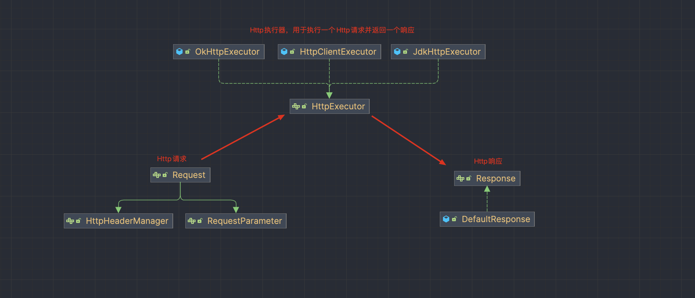

# <center> lucky-httpclient

##  🍀 简介  

---

`lucky-httpclient`是一个简单易用的HTTP客户端工具，提供了`编程式`和`注解式`两种编码方式，并提供了丰富的扩展机制，开发者可以根据自己的需求来定制和扩展

## ⚙️ 安装

---

🪶 Maven  
在项目的`pom.xml`的`dependencies`中加入以下内容:
```xml
    <dependency>
        <groupId>io.github.lucklike</groupId>
        <artifactId>lucky-httpclient</artifactId>
        <version>2.0.0</version>
    </dependency>
```

🐘 Gradle

```groovy
    implementation group: 'io.github.lucklike', name: 'lucky-httpclient', version: '1.0.2'
```

---

## 📃 开发文档

## **一. 编程式开发**

---

编程式开发中主要会涉及到以下三个组件：
1. [Request](./src/main/java/com/luckyframework/httpclient/core/Request.java)  
    请求信息，用于封装http请求信息如：`url`、`method`、`headers`、`query`、`form`、 `body`、`file`等。

2. [Response](./src/main/java/com/luckyframework/httpclient/core/Response.java)
3. [HttpExecutor](./src/main/java/com/luckyframework/httpclient/core/executor/HttpExecutor.java)  

**开发流程如下：**
1. 创建一个用于执行http请求的执行器`HttpExecutor`
2. 创建一个具体的请求对象`Request`
3. 使用执行器的`execute()`方法执行请求，并得到一个响应`Response`
4. 根据业务需求处理响应结果

架构图：  


### 👀 代码示例

---

1️⃣ **【 `GET` 获取百度首页】**


```java
    // 1.创建一个用于执行http请求的请求执行器
    HttpExecutor httpExecutor = new JdkHttpExecutor();

    // 2.创建一个GET请求
    Request req = Request.post("https://www.baidu.com");

    // 3.执行请求返回一个响应
    Response response = httpExecutor.execute(req);
    
    // 4.将相应结果转化为UTF8编码的String类型并打印
    System.out.println(response.getStringResult(StandardCharsets.UTF_8));
```

2️⃣ **【 `POST` 表单提交】**

```java
    // 1.创建一个用于执行http请求的请求执行器
    HttpExecutor httpExecutor = new JdkHttpExecutor();

    // 2.创建一个POST表单提交请求
    Request req = Request.post("http://127.0.0.1:8080/addUser")
        .addFormParameter("name", "Jack")
        .addFormParameter("sex", "男")
        .addFormParameter("age", "22")
        .addFormParameter("vip", true);

    // 3.执行请求返回一个响应
    Response response = httpExecutor.execute(req);
    System.out.println(response.getStringResult());
```

3️⃣ **【文件下载 -- `内存byte模式`】**

```java
    // 图片地址
    String filePath = "https://ts1.cn.mm.bing.net/th/id/R-C.b49dbddffaa692d75988e0c5882dacca?rik=r6IIYs2muimY7A&riu=http%3a%2f%2fwww.quazero.com%2fuploads%2fallimg%2f140529%2f1-140529145A4.jpg&ehk=Co9XURYRCjJXUTzFG0Mw6lD7olzDKceEgv3slEC8kvQ%3d&risl=&pid=ImgRaw&r=0";
    HttpExecutor httpExecutor = new JdkHttpExecutor();
    Request req = Request.get(filePath);
    Response response = httpExecutor.execute(req);
    
    // 使用Response的getMultipartFile方法获取一个MultipartFile对象
    MultipartFile file = response.getMultipartFile();
    // 将图片保存在D盘
    file.copyToFolder("D:/");
```

4️⃣ **【大文件下载 -- `流式下载`】**

```java
    // 系统镜像地址
    String fileUrl = "https://mirrors.sohu.com/centos/8/isos/x86_64/CentOS-8.5.2111-x86_64-dvd1.iso";
    HttpExecutor httpExecutor = new JdkHttpExecutor();
    Request req = Request.get(fileUrl);
    
    // 利用ResponseProcessor接口获取原始响应流后进行流式处理
    httpExecutor.execute(req, new ResponseProcessor() {
        @Override
        public void process(ResponseMetaData responseMeta) {
            try {
                String savePath = StringUtils.format("D:/{}", responseMeta.getDownloadFilename());
                OutputStream out = new BufferedOutputStream(Files.newOutputStream(Paths.get(savePath)));
                FileCopyUtils.copy(responseMeta.getInputStream(), out);
            } catch (IOException e) {
                throw new RuntimeException(e);
            }
        }
    });
```

5️⃣ **【 `POST` 文件上传】**

```java
    Request request = Request.post("http://127.0.0.1:8080/file/upload")
            // 添加本地文件（File）
            .addFiles("file", new File("D:/github-poject/luckliy_v4/LUCKY_V4_TEST/springboot-test/pom.xml"))
            // 添加InputStream
            .addInputStream("file2", "HELP.md", Files.newInputStream(Paths.get("D:/github-poject/luckliy_v4/LUCKY_V4_TEST/springboot-test/HELP.md")))
            // 添加Resource
            .addResources("file3", "classpath:application.properties", "https://ts1.cn.mm.bing.net/th/id/R-C.jpeg");

    HttpExecutor httpExecutor = new JdkHttpExecutor();
    httpExecutor.execute(request);
```

6️⃣ **【Restful请求】**  

```java
    // 使用Map封装参数，也可以使用实体类来封装参数
    Map<String, Object> userMap = new HashMap<>();
    userMap.put("id", 123);
    userMap.put("name", "Test User");
    userMap.put("age", 22);
    userMap.put("email", "test@example.com");

    // 使用setJsonBody()方法设置JSON格式的请求体参数
    Request request = Request.put("http://127.0.0.1:8080/putUser")
                             .setJsonBody(userMap);

    HttpExecutor httpExecutor = new JdkHttpExecutor();
    Response response = httpExecutor.execute(request);
    
    // 当明确返回值为JSON格式的字符串时，可以使用jsonStrToEntity()方法将返回会结果直接反序列化为实体对象
    User entity = response.jsonStrToEntity(User.class);

    // 如果不确定返回值格式时可以使用getEntity()方法来反序列化结果，但是这种方法只支持JSON和XML格式的响应格式
    User entity2 = response.getEntity(User.class);
    System.out.println(entity);
```

7️⃣  **【配置代理】**

```java
    Request request = Request.post("url")
              // 代理无需账号密码，可以直接这样设置
             .setProxy("127.0.0.1", 9080)
              // 如果需要自定其他类型代理或更多的项目，可以这样设置
             .setProxy(new Proxy(Proxy.Type.HTTP,
                     new InetSocketAddress(host, port));
```

 8️⃣ **【超时设置】**
 
```java
    Request request = Request.post("url")
            // 设置连接超时时间
            .setConnectTimeout(2000)
            // 设置读超时时间
            .setReadTimeout(2000)
            // 设置写超时时间
            .setWriterTimeout(2000);
```
9️⃣ **【请求头设置】**

```java
    Request request = Request.post("url")
            // 添加请求头
            .addHeader("token", "2eefefergrthytu6u565kjgjn--")
            // 设置请求头
            .setHeader("Content-Type", "application/json")
            // 简单验证（basicAuth方法）
            .setAuthorization("user", "password")
            // 添加一个Cookie信息
            .addCookie("c1", "fk-7075");
```

🔟 **【使用HttpExecutor.xxxForXxx()方法简化调用流程】**

```java
    HttpExecutor httpExecutor = new JdkHttpExecutor();

    // 使用ForString()方法直接获取String类型结果
    String stringResult = httpExecutor.getForString("https://api.oioweb.cn/api/qq/info?qq={}", 2809110992L);

    // 使用ForEntity()方法直接将响应结果反序列化为实体
    Map map = httpExecutor.getForEntity("https://api.oioweb.cn/api/qq/info?qq={}", Map.class, 2809110992L);

    // 使用ForMultipartFile方法获取响应体中的文件
    MultipartFile multipartFile = httpExecutor.getForMultipartFile("https://ts1.cn.mm.bing.net/th/id/R-C.jpeg");
    
```

## **二. 注解开发**

---
`注解开发`是在`编程式开发`的基础上做了一层封装，进一步的简化了开发。注解开发模式下我们只需要`声明一个接口`，然后使用`特定的注解`进行相关的描述即可,lucky-httpclient底层会使用`动态代理`机制帮我们生成代理对象，通过代理对象便可以完成所有的http请求。

🍋 **使用`HttpClientProxyObjectFactory`生成Http接口的代理对象**
- [HttpClientProxyObjectFactory](./src/main/java/com/luckyframework/httpclient/proxy/HttpClientProxyObjectFactory.java)
    - `getCglibProxyObject(Class<T> interfaceClass)`   使用`Cglib代理`生成代理对象并返回
    - `getJdkProxyObject(Class<T> interfaceClass)`     使用`Jdk代理`生成代理对象并返回

```java
    // 实例化工厂对象
    HttpClientProxyObjectFactory factory = new HttpClientProxyObjectFactory();

    // 使用JDK代理
    HttpApi api1 = factory.getJdkProxyObject(HttpApi.class);
    // 使用Cglib代理
    HttpApi api2 = factory.getCglibProxyObject(HttpApi.class);
```
  
---

🍓 **使用`@HttpRequest`系注解标将接口方法标记为HTTP请求方法**

`@HttpRequest`系注解有：  

| 注解         | 请求方法      |
|------------|-----------|
| `@Get `    | GET请求     |
| `@Post`    | POST请求    |
| `@Delete`  | DELETE请求  |
| `@Put`     | PUT请求     |
| `@Head`    | HEAD请求    |
| `@Patch`   | PATCH请求   |
| `@Connect` | CONNECT请求 |
| `@Options` | OPTIONS请求 |
| `@Trace`   | TRACE请求   |

```java
import com.luckyframework.httpclient.proxy.annotations.Delete;
import com.luckyframework.httpclient.proxy.annotations.Get;
import com.luckyframework.httpclient.proxy.annotations.Post;

public interface JSXSApi {

    // 获取百度首页
    @Get("https://www.baidu.com")
    String baidu();

    // 删除ID为1的book
    @Delete("http://localhost:8080/book/delete/1")
    void deleteBook();

    // 新增一个book
    @Post("http://localhost:8080/book/insert")
    void addBook(Book book);
}

```

---

🍊 **使用`@DomainName`注解提取域名（支持SpEL表达式）**

开发中建议将`同一个域名`或者`同一域名中某个特定的模块`下的Http接口组织到`同一个Java接口`，这样便可以使用 **`@DomainName`** 注解来提取公共域名，方便统一管理。例如：上面的接口加上 **`@DomainName`** 注解之后便可以简化为如下代码：

```java
package com.springboot.testdemo.springboottest.api;
import com.luckyframework.httpclient.proxy.annotations.Delete;
import com.luckyframework.httpclient.proxy.annotations.DomainName;
import com.luckyframework.httpclient.proxy.annotations.Get;
import com.luckyframework.httpclient.proxy.annotations.Post;

// 直接配置域名
@DomainName("http://localhost:8080/book/")

// 使用SpEL表达式获取域名
@DomainName("#{T(com.springboot.testdemo.springboottest.api.JSXSApi).getDomainName()}")
public interface JSXSApi {

    // 获取百度首页
    @Get("https://www.baidu.com")
    String baidu();

    // 删除ID为1的book
    @Delete("/delete/1")
    void deleteBook();

    // 新增一个book
    @Post("/insert")
    void addBook(Book book);
    
    static String getDomainName() {
        return "http://localhost:8080/book/";
    }
}
```

---

🍎 **使用`@DynamicParam`系列注解对方法或者方法参数进行标注**

| 注解                  | 请求参数                            | Request方法           |
|---------------------|---------------------------------|---------------------|
| `@Url`              | 动态设置URL                         | setUrlTemplate()    |
| `@QueryParam`       | 动态设置URL参数                       | addQueryParameter() |
| `@PathParam`        | 动态设置填充URL占位符的参数                 | addPathParameter()  |
| `@URLEncoderQuery`  | 动态设置URL参数（自动UrlEncoder编码）       | addQueryParameter() |
| `@URLEncoderPath`   | 动态设置填充URL占位符的参数（自动UrlEncoder编码） | addPathParameter()  |
| `@FormParam`        | 动态设置表单参数                        | addFormParameter()  |
| `@HeaderParam`      | 动态设置请求头参数                       | addHeader()         |
| `@CookieParam`      | 动态设置设置Cookie信息                  | addCookie()         |
| `@ResourceParam`    | 动态设置文件参数                        | addResources()      |
| `@InputStreamParam` | 动态设置文件参数(InputStream方式)         | addHttpFiles()      |
| `@BodyParam`        | 动态设置请求体参数                       | setBody()           |
| `@JsonBody`         | 动态设置JSON格式的请求体参数（自动序列化为JSON字符串） | setBody()           |
| `@XmlBody`          | 动态设置XML格式的请求体参数（自动序列化为XML字符串）   | setBody()           |

<font color='red'>注：</font>遇到下面这些`特殊类型`时`@DynamicParam`注解不会生效：
1. 当方法参数为`ResponseProcessor`类型时，不做任何设置。
2. 当方法参数为`File`、`Resource`、`MultipartFile`、`HttpFile`类型或者为`这些类型的数组`或`集合`时，会使用`addHttpFiles()`进行参数设置。
3. 当方法参数为`BodyObject`类型时，会使用`setBody()`方法进行参数设置。

**_如果方法或者方法参数上没有标注任何`@DynamicParam`注解时，则默认使用`addQueryParameter()`方法进行参数设置。_**
`@DynamicParam`注解的具体用法：

```java


import com.luckyframework.httpclient.proxy.annotations.Get;
import com.luckyframework.httpclient.proxy.annotations.QueryParam;
import com.luckyframework.httpclient.proxy.annotations.Url;
import com.luckyframework.io.MultipartFile;

@DomainName("http://localhost:8080/users")
public interface UserApi {

    /*
        没有任何注解时，默认方法参数为URL参数
        GET http://localhost:8080/users/getById?id=id_value 
     */
    @Get("/getById")
    User getUserById(Integer id);

    /*
         @QueryParam注解标注的参数将设置为Url参数(query参数)   
     */
    @Get("/getById")
    User getUserById2(@QueryParam("id") Integer number);

    /*
        @PathParam注解标注的参数将设置为填充Url占位符'{}'的参数
        GET http://localhost:8080/users/get/num_value
     */
    @Get("/get/{id}")
    User getUser(@PathParam("id") Integer num);

    /*
        @HeaderParam注解标注的参数将设置为Header参数
        @CookieParam注解标注的参数将设置为Cookie参数
        
        DELETE  http://localhost:8080/users/cookieHeader
        token: token_value
        Cookie: sessionId=sessionId_value; userId=userId_value
     */
    @Delete("cookieHeader")
    void cookieHeader(@HeaderParam("token") String c, @CookieParam("sessionId") String h, @CookieParam("userId") String u);

    /*
        @FormParam注解表示表单提交，lucky底层会将展开User的所有属性来形成表单内容
        POST http://localhost:8080/users/get/insertByForm
        Content-Type: application/x-www-form-urlencoded
        
        id=id_value&
        name=name_value&
        sex=sex_value&
        age=age_value&
        email=email_value
     */

    @Post("insertByForm")
    void insertUser(@FormParam User user);

    /*
        @JsonBody注解标注的参数会被序列化为JSON格式字符串
        POST http://localhost:8080/users/get/insertByJson
        Content-Type: application/json;
        
        {
            "id": "id_value",
            "name": "name_value",
            "age": "age_value",
            "sex": "sex_value",
            "email": "email_value",
        }    
     */
    @Post("insertByJson")
    void insertByJson(@JsonBody User user);

    /*
        文件上传，File、Resource、MultipartFile、HttpFile这四种类型或者这些类型的数组或集合会自动的当做文件参数来处理
        POST http://localhost:8080/users/fileUpload
        Content-Type: multipart/form-data; boundary=LuckyBoundary
        
        --LuckyBoundary
        Content-Disposition: form-data; name="msg"
        Content-Type: text/plain
        
        msg_value
        --LuckyBoundary
        Content-Disposition: form-data; name="files"; filename="test.jpg"
        Content-Type: image/jpeg
        
        < D:/test/test.jpg
        --LuckyBoundary
        Content-Disposition: form-data; name="files"; filename="data.json"
        Content-Type: application/json
        
        < D:/json/data.json
     */
    @Post("fileUpload")
    void fileUpload(File[] files, @FormParam String msg);

    /*
        使用@ResourceParam注解来实现文件上传，lucky底层会将@ResourceParam注解标注的方法参数转化为Resource[]后进行文件参数处理
        这里支持String、String[]、Collection<String>等类型的参数转换，字符串内容为Spring的资源路径表达式,请参考ResourceLoader.getResource()
        例如：
        
        1. file:D:/test.jpg
        2. classpath:static/text.txt
        3. http://localhost:8080/files/test.jpg
        ...
     */
    @Post("fileUpload")
    void fileUpload(@ResourceParam String[] files, @FormParam String msg);

    /*
        使用@Url注解来实现动态Url切换的功能
        eg: 
        imageUrl="http://localhost:8080/files/test.jpg"
        GET http://localhost:8080/files/test.jpg
        
        imageUrl="http://localhost:8084/user/application.yml"
        GET http://localhost:8084/user/application.yml
     */
    @Get
    MultipartFile getImage(@Url String imageUrl);
}
```

🍒   **使用`@StaticParam`系列注解设置静态参数**


