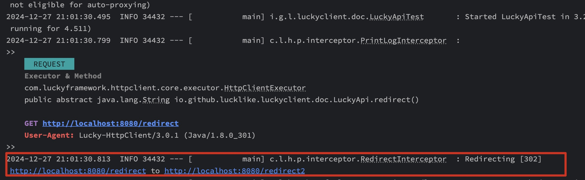

## 😮‍💨设置自动重定向
HTTP 重定向是指在 Web 请求中，服务器指示客户端（如浏览器）将请求的资源重定向到另一个 URL。重定向通常用于以下情况：

- 资源已移动：例如，页面或文件位置已更改，客户端需要访问新位置。
- 网站结构变化：例如，网站的 URL 结构发生变化，但仍需要将访问者引导到新位置。
- 负载均衡：将请求导向负载均衡器或不同的服务器。

### **HTTP 重定向的状态码**
HTTP 重定向通常由服务器返回特定的状态码，这些状态码指示客户端需要采取的操作：
1. 301 Moved Permanently（永久移动）

    
- 表示请求的资源已经被永久移动到新的 URL，客户端应自动更新其书签或链接。
- 示例：
```http request
HTTP/1.1 301 Moved Permanently
Location: https://new-url.example.com
```

2. 302 Found（临时移动）

- 表示请求的资源暂时移动到另一个 URL，客户端应继续使用原 URL 进行后续请求。
- 示例：
```http request
HTTP/1.1 302 Found
Location: https://temporary-url.example.com
```

3. 303 See Other（查看其他）

- 服务器指示客户端应使用 GET 请求访问另一个 URL。这通常用于表单提交后的重定向。
- 示例：
```http request
HTTP/1.1 303 See Other
Location: https://another-url.example.com
```

4. 307 Temporary Redirect（临时重定向）

- 类似于 302，表示资源临时移动，且客户端应继续使用相同的 HTTP 方法（如 POST）访问新 URL。
- 示例：
- 
```http request
HTTP/1.1 307 Temporary Redirect
Location: https://new-url.example.com
```

5. 308 Permanent Redirect（永久重定向）

- 类似于 301，但客户端应保持使用相同的 HTTP 方法（如 POST）来访问新 URL。
- 示例：
```http request
HTTP/1.1 308 Permanent Redirect
Location: https://new-url.example.com
```

### **如何工作**
- 客户端发送一个请求（例如，通过浏览器访问某个 URL）。
- 服务器接收到请求后，返回一个带有 `Location` 头的 HTTP 响应，并附带重定向状态码。
- 客户端根据状态码和 `Location` 头的值，自动向新的 URL 发起请求。
### **应用场景**
- **URL 结构变化**：当网站更改了 URL 结构时，通过 HTTP 重定向将用户引导到新页面，保持搜索引擎排名和访问链接的有效性。
- **网站迁移**：当整个网站迁移到新的域名或服务器时，使用 301 或 302 状态码将用户从旧域名重定向到新域名。
- **HTTPS 强制**：将 HTTP 请求重定向到 HTTPS 版本，以提高安全性。  
通过合理配置 HTTP 重定向，可以改善用户体验和网站的 SEO 表现。

___
### #全局生效的重定向配置

1. **原生环境**

```java
        HttpClientProxyObjectFactory httpProxy = new HttpClientProxyObjectFactory();
            // 注册重定向拦截器配置
            httpProxy.addInterceptor(RedirectInterceptor.class, Scope.METHOD, ri -> {
            // 一次请求允许的最大重定向次数
            ri.setMaxRedirectCount(5);
            // 默认需要进行重定向操作的状态码
            ri.setRedirectStatus(new Integer[]{301, 302, 303, 304, 307, 308});
            // # 获取重定向地址的SpEL表达式
            ri.setRedirectLocationExp("#{$respHeader$.Location}");
            // 决定是否进行重定向的SpEL表达式，注：该配置的优先级要大于status
            ri.setRedirectCondition("#{You Condition}");
        }, PriorityConstant.REDIRECT_PRIORITY);
```

2. `SpringBoot`环境  
`application.yml`
```yaml
lucky:
  http-client:
    redirect:
      # 开启重定向功能
      enable: true
      # 一次请求允许的最大重定向次数
      max-count: 5
      # 默认需要进行重定向操作的状态码
      status: [301, 302, 303, 304, 307, 308]
      # 获取重定向地址的SpEL表达式
      location: "#{$repHeader$.Location}"
      # 决定是否进行重定向的SpEL表达式，注：该配置的优先级要大于status
      condition: "#{You Condition}"
```

---
### #使用`@AutoRedirect`注解来进行类级别或者方法级别的重定向配置

> 将`@AutoRedirect`注解标注在方法上表示该方法中的所有方法均支持自动重定向

```java
@DomainName("http://localhot:8080/")
public interface RedirectDemoApi {

    @AutoRedirect
    @Get("/redirect")
    String redirect();

    // 自定义重定向逻辑
    // 例如当检测到状态码为404时，重定向到
    /*
        自定义重定向逻辑
        例如：
        重定向条件：
            1.状态码：404
            2.入参tag为"R"
        重定向地址：
            http://localhost:8080/404        
     */
    @AutoRedirect(
        location = "http://localhost:8080/404",
        condition = "#{($status$ == 404) and ('R' eq tag) }"
    )
    @Get("redirect")
    String customRedirect(String tag);
    
}
```
重定向日志如下：
