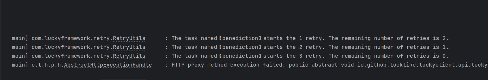

## 🫨 重试机制

HTTP 重试机制是指在某些情况下，客户端（例如浏览器、API
调用程序）在未收到服务器的预期响应或出现错误时，自动或手动重新发送请求的过程。重试机制旨在提高请求的可靠性，但需要适当设计，以避免引发不必要的负载或数据不一致。

### 适用场景

HTTP 重试机制通常在以下情况下使用：

1. **网络中断或超时***：
    - 客户端无法在指定的时间内收到服务器响应。
    - 适合使用幂等方法（如 `GET`、`HEAD`、`PUT` 或 `DELETE`）重试。


2. **瞬态错误（5xx 状态码）**：

    - 服务器短暂不可用，例如返回 `503 Service Unavailable`。
    - 可能由于服务器过载或临时维护导致。


3. **限流或速率限制（429 状态码）**：
    - 服务器明确告知客户端因超出速率限制需稍后重试。


4. **连接被重置**：
    - 服务器在建立连接时中断，例如 TCP 重置。

### 不适用场景

在以下情况下，应谨慎或避免使用重试机制：

1. **非幂等操作（如 `POST`）**：
    - 重试可能导致重复创建资源或触发重复操作。


2. **客户端逻辑错误（`4xx` 状态码，如 `400`、`401`、`403`、`404`）**：
    - 这些通常是由于客户端错误引起的，重试无效。


3. **超出最大重试次数**：

    - 长时间重试可能导致资源浪费或对服务器产生额外压力。

---

### #使用`@Retryable`注解开启重试机制

`@Retryable`注解的属性说明：

| 属性                | 说明                                                                                                                                           |
|-------------------|----------------------------------------------------------------------------------------------------------------------------------------------|
| `name`            | 为当前重试任务取个名字，默认名字为方法名                                                                                                                         |
| `retryCount`      | 最大重试次数，超过限制会抛异常，默认值: `3`                                                                                                                     |
| `waitMillis`      | 重试等待时间，任务执行失败之后会等待n毫秒之后再次执行，默认值：`1000L`                                                                                                      |
| `maxWaitMillis`   | 最大的重试等待时间，`waitMillis`值大于该值时会失效                                                                                                              |
| `minWaitMillis`   | 最小的重试等待时间，`waitMillis`值小于该值时会失效                                                                                                              |
| `multiplier`      | `Backoff`算法中的倍数（默认值为`0`即不启用`Backoff`算法）: <br/>**倍数大于1时**：`等待时间 = 倍数 *（重试次数 - 1)  * 最初等待时间`<br/>**倍数小于1时**：`等待时间 = 倍数 ^ (重试次数 - 1 ) * 最初等待时间` |
| `retryFor`        | 指定需要重试的异常类型，默认值为`Exception`                                                                                                                  |
| `exclude`         | 指定不需要重试的异常类型                                                                                                                                 |
| `normalStatus`    | 指定正常的状态码，不在此范围的状态码则需要重试                                                                                                                      |
| `exceptionStatus` | 指定异常的状态码，在此范围的状态码则需要重试                                                                                                                       |
| `retryExpression` | 重试表达式，使用一个`SpEL`表达式来决定是否需要重试                                                                                                                 |
| `retryFunc`       | 指定一个用于决定当前任务是否需要重定向的的SpEL函数的函数名                                                                                                              |

实例：

1. `@Retryable`注解标注在类上，表示类中的`所有方法`都`开启重试机制`，如果某些方法不希望应用重试机制则加上
   `@RetryProhibition`注解即可

```java
// @Retryable注解标注在类上，表示类中的所有方法都开启重试机制，如果某些方法不希望应用重试机制则加上@RetryProhibition注解
@Retryable
@DomainName("http://localhost:8080/")
public interface RetryDemoApi {

    // 自动应用类上的配置的重试机制
    @Get("/retry1")
    String retry1();

    // 应用方法上配置的重试机制
    @Retryable(retryCount = 5, waitMillis = 2000L)
    @Get("/retry2")
    String retry2();

    // 禁止重试
    @RetryProhibition
    @Get("/notRetry")
    String notRetry();

}
```

2. **使用`retryFor`和`exclude`属性来指定或排除需要重试的的异常**
```java
@DomainName("http://localhost:8080/")
public interface RetryDemoApi {
    /*
       1.出现指定异常时才进行重试    
       例如：出现HttpExecutorException、NullPointerException时才重试 
     */
    @Retryable(retryFor = {HttpExecutorException.class, NullPointerException.class})
    @Get("/specifyExceptionRetry")
    String specifyExceptionRetry();


    /*
       2.在某些异常范围内排除某些特定的异常   
       例如：出现Exception时进行重试，但是如果是NullPointerException则不进行重试
    */
    @Retryable(retryFor = Exception.class, exclude = NullPointerException.class)
    @Get("/excludeExceptionRetry")
    String excludeExceptionRetry();
}
```

3. **使用`normalStatus`和`exceptionStatus`属性来指定正常或者异常状态码**

```java

@DomainName("http://localhost:8080/")
public interface RetryDemoApi {

    /*
       1.非异常情况下，根据状态码来决定是否需要重试 --> 指定正常的状态码，非正常状态码则重试
       例如：非异常情况，状态码为200、201、202时不用重试，其他情况均需要重试
    */
    @Retryable(normalStatus = {200, 201, 202})
    @Get("/normalStatusRetry")
    String normalStatusRetry();

    /*
       2.非异常情况下，根据状态码来决定是否需要重试 --> 指定异常的状态码
       例如：非异常情况，指定异常状态码为500、429、203、501，出现这些状态码时则需要重试
    */
    @Retryable(exceptionStatus = {500, 429, 203, 501})
    @Get("/exceptionStatusRetry")
    String exceptionStatusRetry();

}


```

4. **使用`retryExpression`属性配置`SpEL表达式`来决定当前任务是否需要重试**

```java
@DomainName("http://localhost:8080/")
public interface RetryDemoApi {
    
   /*
    1.自定义重试条件，使用上下文中的needRetry函数来决定是否需要进行重试
    */
   @Retryable(retryExpression = "#{#needRetry($resp$, $throwable$, test)}")
   @Get("/customRetry")
   String customRetry(String test);

   // customRetry方法指定的是否需要进行重试的判定方法
   static booelan needRetry(Response response, Throwable throwable, String test) {
      // 有异常则重试
      if (throwable != null) {
         return true;
      }

      // 状态码为5xx时重试
      int status = response.getStatus();
      if (status % 100 != 5) {
         return true;
      }

      // 响应码code不为0000时进行重试
      return !Objects.equals("0000", configMap.getString("code"));
   }
}
```

5. **使用`retryFunc`属性类指定一个用于决定当前任务是否需要重试的`SpEL函数`**

>`retryFunc`与`retryExpression`属性的区别在于，后者需要手动传参，而前者只需要指定函数名，不需要进行手动传参，lucky会自动解析
方法的参数列表来获取参数值来进行调用
> - 获取`SpEL上下文中`的变量：使用`@Param`注解，例如获取参数列表`@Param("#{$args$}")`
> - 获取`Spring`容器中的`Bean`: 使用`@Qualifier`注解来指定Bean的名称
> - 其他情况会根据类型到`Spring`容器中进行查找
> - 使用`@AllowNull`注解来标注某个参数可以为null
   

- **指定函数名**
```java
@DomainName("http://localhost:8080/")
public interface RetryDemoApi {

   /*
      1.将决定是否需要进行重试的逻辑指定给一个SpEL函数，当前案例中指定的SpEL函数名为specifyFunction     
    */
   @Retryable(retryFunc = "specifyFunction")
   @Get("/appointRetry")
   String specifyRetryFunc(String test);

   /*
      决定specifyRetryFunc方法是否进行重试的方法
   */
   static boolean specifyFunction(TaskResult<Response> taskResult, MethodContext context, @Param("#{test}") String test) {

      // 异常为HttpExecutorException时进行重试
      Throwable throwable = taskResult.getThrowable();
      if (throwable instanceof HttpExecutorException) {
         return true;
      }

      // 状态码不为200时重试
      int status = response.getStatus();
      if (status != 200) {
         return true;
      }

      // 响应码code不为0000时进行重试
      ConfigurationMap configMap = response.getConfigMapResult();
      return !Objects.equals("0000", configMap.getString("code"));
   }
}
```

- **不指定函数名，使用约定的SpEL方法**

> 1. 针对整个类，约定的SpEL函数名：`Introspector.decapitalize(类名)+$NeedRetry`
> 2. 针对某个方法，约定的SpEL函数名：`方法名+$NeedRetry`

```java
@Retryable
@DomainName("http://localhost:8080/")
public interface RetryDemoApi {

   @Get("/appointRetry")
   String appointClassRetryFunc(String test);

   @Get("/appointRetry")
   String appointMethodRetryFunc(String test);

   /*
      【Introspector.decapitalize(类名)+$NeedRetry】 -->  retryDemoApi$NeedRetry     
       类级别的约定方法，用于决定当前任务是否需要进行重试
    */
   static boolean retryDemoApi$NeedRetry(TaskResult<Response> taskResult, MethodContext context, @Param("#{$args$}") Object[] args) {
       
       //...................具体逻辑代码忽略...............//
      
       return true;
   }

   /*
    【方法名+$NeedRetry】 -->  appointMethodRetryFunc$NeedRetry     
    方法级别的约定方法，用于决定当前任务是否需要进行重试
 */
   static boolean appointMethodRetryFunc$NeedRetry(TaskResult<Response> taskResult, MethodContext context, @Param("#{$args$}") Object[] args) {

      //...................具体逻辑代码忽略...............//

      return false;
   }
}
```


6. **重试日志**

   重试过程中能看到如下格式的日志：
   
