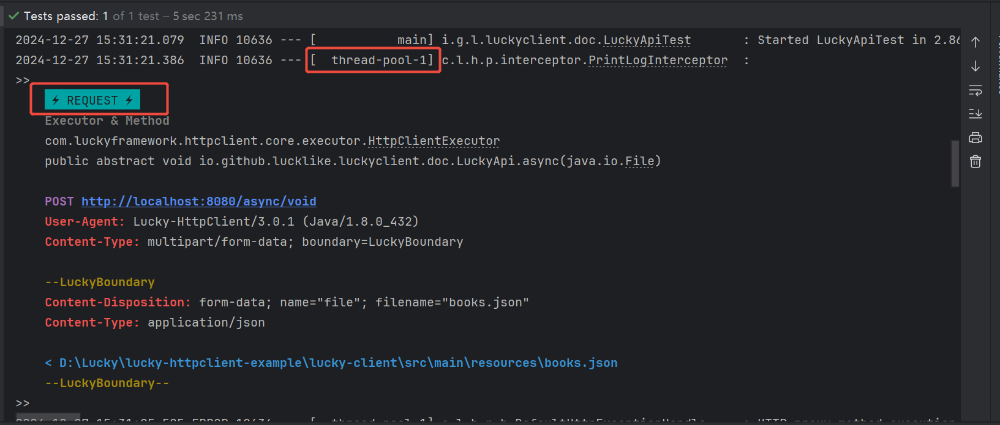
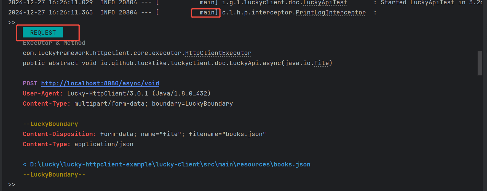

## ⚡ 异步请求

在 Java 中，发送`异步 HTTP` 请求意味着你可以在不阻塞主线程的情况下发送 `HTTP 请求`并处理响应。这对于提高应用程序的性能和响应速度特别重要，尤其是在需要同时发送多个` HTTP 请求`时。

`lucky`中提供了非常方便的异步请求请求方案，具体如下：

---
### #配置线程池

1. 线程池配置-原生环境
```java

//-------------------------------------------------------------------------------------------
//                                   设置主线程池
//-------------------------------------------------------------------------------------------

// 设置主线程池 -- 启动时初始化
HttpClientProxyObjectFactory factory = new HttpClientProxyObjectFactory();
factory.setAsyncExecutor(
         new ThreadPoolExecutor(
            10,
            15,
            100,
            TimeUnit.MILLISECONDS,
            new ArrayBlockingQueue<>(50),
            new NamedThreadFactory("pool2-"),
            new ThreadPoolExecutor.CallerRunsPolicy()
        )
);

-------------------------------------------------------------------------------------------

// 设置主线程池 -- 运行时初始化
HttpClientProxyObjectFactory factory = new HttpClientProxyObjectFactory();
factory.setAsyncExecutor(
    () -> new ThreadPoolExecutor(
           10,
           15,
           100,
           TimeUnit.MILLISECONDS,
           new ArrayBlockingQueue<>(50),
           new NamedThreadFactory("pool2-"),
           new ThreadPoolExecutor.CallerRunsPolicy()
    )
);

//-------------------------------------------------------------------------------------------
//                                   添加备用线程池
//-------------------------------------------------------------------------------------------

// 添加备用线程池--启动时初始化
HttpClientProxyObjectFactory factory = new HttpClientProxyObjectFactory();
factory.addAlternativeAsyncExecutor(
        "pool1",
        new ThreadPoolExecutor(
                10,
                15,
                100,
                TimeUnit.MILLISECONDS,
                new ArrayBlockingQueue<>(50),
                new NamedThreadFactory("pool-"),
                new ThreadPoolExecutor.CallerRunsPolicy()
        ));

-------------------------------------------------------------------------------------------

// 添加备用线程池--运行时初始化
HttpClientProxyObjectFactory factory = new HttpClientProxyObjectFactory();
factory.addAlternativeAsyncExecutor(
        "pool2",
        () -> new ThreadPoolExecutor(
                10,
                15,
                100,
                TimeUnit.MILLISECONDS,
                new ArrayBlockingQueue<>(50),
                new NamedThreadFactory("pool2-"),
                new ThreadPoolExecutor.CallerRunsPolicy()
        ));
```

2. SpringBoot环境配置线程池

`application.yml`
```yaml
lucky:
  http-client:
    async-thread-pool:
      # 主线程池配置
      core-pool-size: 10
      blocking-queue-size: 100
      maximum-pool-size: 20
      keep-alive-time: 1000
      # 备用线程池配置
      alternative:
        # 备用线程池1 -- pool1
        pool1:
          core-pool-size: 5
          blocking-queue-size: 20
          maximum-pool-size: 10
          name-format: pool1-
          keep-alive-time: 1000
        # 备用线程池2 -- pool2
        pool2:
          core-pool-size: 6
          blocking-queue-size: 12
          maximum-pool-size: 12
          name-format:  pool2-
          keep-alive-time: 1000
```

---
### #使用`@Async`注解来将某个`void`方法设置为异步请求
对于`void`方法，必须使用`@Async`注解来开启异步功能，另外可以使用`value`属性指定线程池

```java
// 默认使用主线程池
@Async
@Post("http://localhost:8080/async/void")
void async(@MultiFile File binary);

// 使用备用线程池 pool1
@Async("pool1")
@Post("http://localhost:8080/async/void")
void async(@MultiFile File binary);
```

---
### # 非`void`方法将返回结果改为`Future`包装类即可设置为异步请求

```java
// 将结果包装成Future类型之后即自动转为异步请求
@Post("http://localhost:8080/user/get")
Future<User> getUser(@JsonParam String id);

// 将结果包装成Future类型之后即自动转为异步请求，使用@AsyncExecutor注解来指定线程池
@AsyncExecutor("poo2")
@Post("http://localhost:8080/user/get")
Future<User> getUser(@JsonParam String id);
```

---
### #将`@Async`注解提到类上，将类中的所有`void`方法均设置为异步方法

```java
// 将所有void方法都设置为异步请求，并指定使用pool2线程池
@Async("pool2")
@DomainName("http://localhost:8080/")
public interface AsyncApi {

    @Post("/async")
    void async();

    // 将线程池改为pool1
    @AsyncExecutor("pool1")
    @Post("/async")
    void async2();

    // @Async(enable = false)标识取消异步请求，即当前请求为同步请求
    @Async(enable = false)
    @Post("/sync")
    void syncMethod();

    @Get("/user/get")
    Future<User> getUser(@JsonParam String id);

    // 将线程池改为pool1
    @AsyncExecutor("pool1")
    @Get("/user/get")
    Future<User> getUser2(@JsonParam String id);
}


```

---
### #异步请求日志
异步请求的日志会有个⚡标致，如图

下面时同步请求的日志
