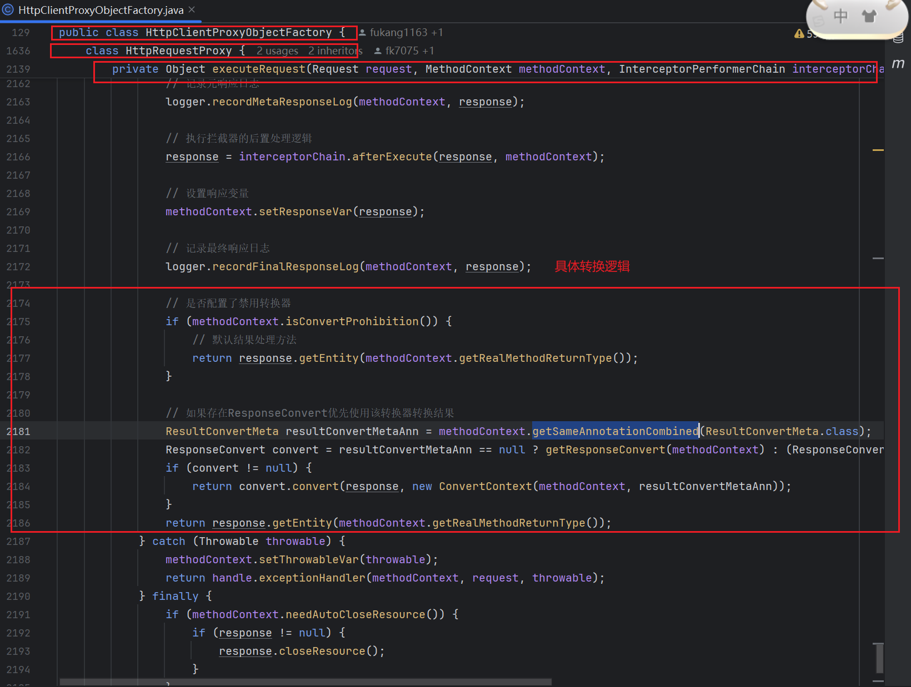
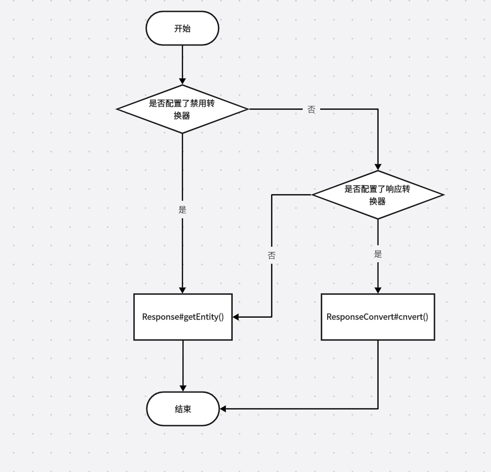

## 🦉 Http接口方法默认支持的返回值类型

要知道通过`HTTP执行器`返回的始终是`Response`对象，但是HTTP代理接口支持的返回值类型是多种多样的，这两者之间是如何转换的呢？
本章节会对这个问题进行探讨。
---

### # 源码解析
这个问题的答案其实很简单，在源码[HttpClientProxyObjectFactory$HttpRequestProxy#executeRequest()](../../../src/main/java/com/luckyframework/httpclient/proxy/HttpClientProxyObjectFactory.java)中可以很清楚的看到转换逻辑
其中的核心代码如图所示：



---
### # 分析说明

在上面的`源码解析`部分中可以清楚的看到，负责响应结果转换的有两套API

1. 通过[Response](../../../src/main/java/com/luckyframework/httpclient/core/meta/Response.java)对象的`getEntity()`方法进行结果转换。
2. 通过[ResponseConvert](../../../src/main/java/com/luckyframework/httpclient/proxy/convert/ResponseConvert.java)接口的`convert()`方法进行转换

具体流程图如下：  


---

### # 默认情况下接口支持的返回值类型分析

默认情况下，响应转换工作是由`Response#getEntity()`来实现的，以下是该方法的源码
```java
/**
     * 自动将响应的数据转化为实体类
     * <pre>
     *     1.特定类型的固定返回逻辑
     *       {@link Void} {@link Void void}                     ->   <b>null</b>
     *       {@link Response}                                   ->   <b>this</b>
     *       {@link HeaderMataData} {@link ResponseMetaData}    ->   {@link #getResponseMetaData()}
     *       {@link MultipartFile}                              ->   {@link #getMultipartFile()}
     *       {@link InputStream}                                ->   {@link #getInputStream()}
     *       {@link InputStreamSource}                          ->   {@link #getInputStreamSource()}
     *       {@link byte[]} {@link ByteArrayInputStream}        ->   {@link #getResult()}
     *       {@link String}                                     ->   {@link #getStringResult()}
     *    2.使用注册的{@link AutoConvert}进行转换
     *    3.根据<b>Content-Type</b>进行自动类型转换
     *       <b>application/json</b>                            ->   {@link #jsonStrToEntity(Class)}
     *       <b>application/xml</b>                             ->   {@link #xmlStrToEntity(Type)}
     *       <b>application/x-java-serialized-object</b>        ->   {@link #javaObject()}
     *   如果无法转化或者转化失败会时抛出一个{@link SerializationException}异常
     * </pre>
     *
     * @param type 实体的泛型
     * @param <T>  类型
     * @return type类型的实体对象
     */
    @SuppressWarnings("unchecked")
    default <T> T getEntity(Type type) {

        // void类型
        if (void.class == type || Void.class == type) {
            return null;
        }
        // Response类型
        if (Response.class == type) {
            return (T) this;
        }
        // 元数据
        if (HeaderMataData.class == type || ResponseMetaData.class == type) {
            return (T) this.getResponseMetaData();
        }
        // 文件、流类型的结果处理
        if (MultipartFile.class == type) {
            return (T) getMultipartFile();
        }
        if (InputStream.class == type) {
            return (T) getInputStream();
        }
        if (ByteArrayInputStream.class == type) {
            return (T) new ByteArrayInputStream(getResult());
        }
        if (InputStreamSource.class == type) {
            return (T) getInputStreamSource();
        }
        if (byte[].class == type) {
            return (T) getResult();
        }

        if (String.class == type) {
            return (T) getStringResult();
        }

        // 尝试使用自动转换器进行转换
        for (AutoConvert autoConvert : autoConvertList) {
            if (autoConvert.can(this, type)) {
                return autoConvert.convert(this, type);
            }
        }

        // Json、Xml、Java类型转换
        try {
            if (isJsonType()) {
                return jsonStrToEntity(type);
            }
            if (isXmlType()) {
                return xmlStrToEntity(type);
            }
            if (isJavaType()) {
                return (T) javaObject();
            }
            throw new SerializationException("The response result the auto-conversion is abnormal: No converter found that can handle 'Content-Type[" + getContentType() + "]'.");
        } catch (Exception e) {
            throw new SerializationException(e);
        }
    }
```

分析源码可知，默认情况下HTTP接口支持的返回值类型有：

- `void`/`Void` -> 固定返回值为`null`
- `Response` -> 固定返回当前Response对象
- `HeaderMataData`/`ResponseMetaData` -> 固定返回当前响应的元数据
- `MultipartFile` -> 固定返回`MultipartFile`对象，适用于文件下载场景
- `InputStream` -> 固定返回当前响应体对应的输入流对象
- `InputStreamSource` -> 固定返回当前响应体对应的输入流工厂对象
- `ByteArrayInputStream` -> 固定返回当前响应体的字节流对象
- `byte[]` -> 固定返回当前响应体内容对应的字节数组
- `String` -> 固定返回当前响应体的内容的字符串格式
- 由`AutoConvert`支持的响应类型
- `application/json`、`application/xml`、`application/x-java-serialized-object` -> 这三种格式的响应体会分别使用`Jackson`、`JAXB`、`ObjectInputStream`进行反序列化，目标类型为接口的返回值类型
- 以上类型的`Optional`包装类型
- 以上类型的`Future`包装类型

```java
import com.luckyframework.httpclient.core.meta.HeaderMataData;
import com.luckyframework.httpclient.core.meta.Response;
import com.luckyframework.httpclient.core.meta.ResponseMetaData;
import com.luckyframework.httpclient.proxy.annotations.DomainName;
import com.luckyframework.httpclient.proxy.annotations.Get;
import com.luckyframework.io.MultipartFile;
import org.springframework.core.io.InputStreamSource;

import java.io.ByteArrayInputStream;
import java.io.InputStream;
import java.util.Optional;
import java.util.concurrent.Future;

@DomainName("http://localhost:8864/convert")
public interface ConvertApi {

    // 支持void/Void作为返回值
    @Get("respTo")
    void voidMethod();

    // 支持Response作为返回值
    @Get("respTo")
    Response resp();

    // 支持HeaderMataData作为返回值
    @Get("respTo")
    HeaderMataData headerMeta();

    // 支持ResponseMetaData作为返回值
    @Get("respTo")
    ResponseMetaData respMeta();

    // 支持byte[]作为返回值
    @Get("respTo")
    byte[] bytes();

    // 支持InputStream作为返回值
    @Get("respTo")
    InputStream inStream();

    // 支持ByteArrayInputStream作为返回值
    @Get("respTo")
    ByteArrayInputStream byteStream();

    // 支持InputStreamSource作为返回值
    @Get("respTo")
    InputStreamSource inStreamSource();

    // 支持MultipartFile作为返回值
    @Get("respTo")
    MultipartFile multiFile();

    // 支持String作为返回值
    @Get("respTo")
    String str();

    // 如果响应类型为application/json，使用Jackson将Json格式的响应体内容转化为Result<User>类型
    @Get("respTo")
    Result<User> jsonAutoConvert();

    // 如果响应类型为application/xml，使用JAXB将Xml格式的响应体内容转化为Result<User>类型
    @Get("respTo")
    Result<User> xmlAutoConvert();

    // 如果响应类型为application/x-java-serialized-object，使用ObjectInputStream将响应体内容反序列化为Map<String, Object>对象
    @Get("respTo")
    Map<String, Object> jdkAutoConvert();

    // 支持以上类型的Optional包装类型
    @Get("respTo")
    Optional<String> optionalStr();

    // 支持以上类型的Future包装类类型
    @Get("respTo")
    Future<InputStream> futureInStream();
}
```
