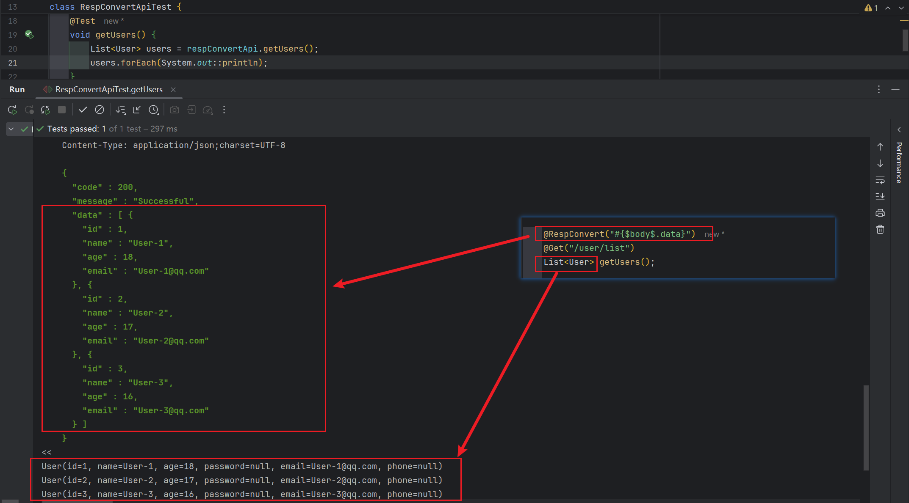
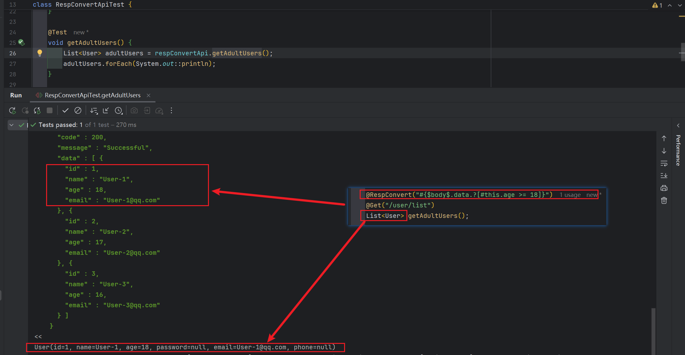
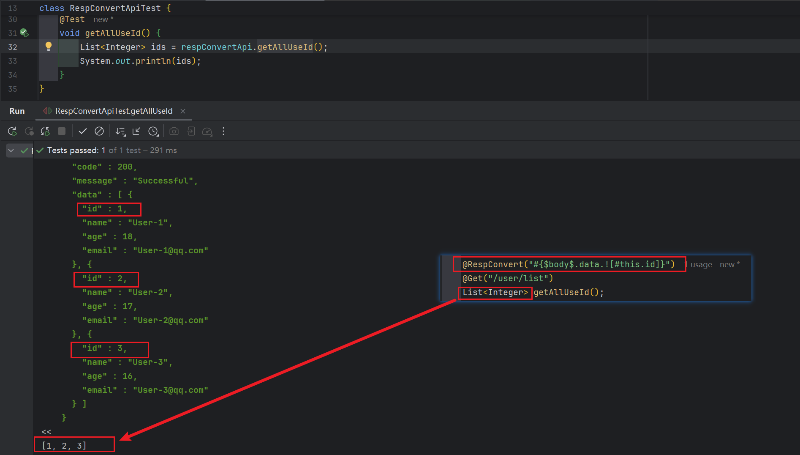
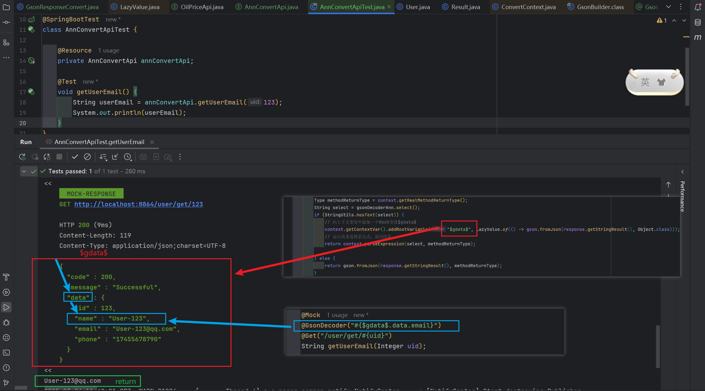

## 🦄 注解转换器[（ResponseConvert）](../../../src/main/java/com/luckyframework/httpclient/proxy/convert/ResponseConvert.java)

`ResponseConvert`
为注解转换器，它的注册依赖于[@ResultConvertMeta](../../../src/main/java/com/luckyframework/httpclient/proxy/annotations/ResultConvertMeta.java)
注解，相对通用转换器`Response.AutoConvert`来说，注解转换器的优`先级别更高`、`控制力度更细`，所以更加适合一些特殊的转换需求。

---

### # 接口介绍

**注解转换器接口**：`ResponseConvert`  
该接口主要负责数据转换与处理相关的逻辑
```java

@FunctionalInterface
public interface ResponseConvert {

    /**
     * 将相应实体转化为指定类型的实体
     *
     * @param response 响应实体
     * @param context  转化器注解上下文
     * @param <T>      返回实体类型
     * @return 返回实体
     * @throws Exception 转换失败会抛出异常
     */
    <T> T convert(Response response, ConvertContext context) throws Throwable;
}
```

**用于注册注解转换器的元注解**`@ResultConvertMeta`  
该注解用于注册注解转换器，使其生效
```java
@Target({ElementType.METHOD, ElementType.TYPE, ElementType.ANNOTATION_TYPE})
@Retention(RetentionPolicy.RUNTIME)
@Documented
@Inherited
@ConvertMetaType
public @interface ResultConvertMeta {

    /**
     * 响应结果转换器生成器，用于生成{@link ResponseConvert}对象的生成器
     */
    ObjectGenerate convert();

    /**
     * 转换元类型
     */
    @AliasFor(annotation = ConvertMetaType.class, attribute = "value")
    Class<?> metaType() default Object.class;

}

```

---

### # 已实现的注解转换器

| 实现类                                                                                                                                                                                                                                                  | 说明                                        |
|------------------------------------------------------------------------------------------------------------------------------------------------------------------------------------------------------------------------------------------------------|-------------------------------------------|
| [@RespConvert](../../../src/main/java/com/luckyframework/httpclient/proxy/annotations/RespConvert.java)  +  [ResultSelectionResponseConvert](../../../src/main/java/com/luckyframework/httpclient/proxy/convert/ResultSelectionResponseConvert.java) | 提供基于`SpEL表达式`实现的响应数据`筛选`、`过滤`、`处理`、`整合`功能 |
| [@DownloadToLocal](../../../src/main/java/com/luckyframework/httpclient/proxy/annotations/DownloadToLocal.java) + [FileDownloadResultConvert](../../../src/main/java/com/luckyframework/httpclient/proxy/convert/FileDownloadResultConvert.java)     | 实现文件下载到本地磁盘的功能                            |
| [@SseResultConvert](../../../src/main/java/com/luckyframework/httpclient/proxy/sse/SseResultConvert.java) + [SseResponseConvert](../../../src/main/java/com/luckyframework/httpclient/proxy/sse/SseResponseConvert.java)                             | 实现SSE响应结果处理的基本功能                          |

 #### `@RespConvert`**使用说明** ：

1. **数据定位功能**  

```java
@DomainName("http://localhost:8864/user/")
public interface RespConvertApi {

    // #{$body$.data} ：只获取响应体'data'部分的数据进行转换
    @Mock(mockFunc = "userList")
    @RespConvert("#{$body$.data}")
    @Get("/user/list")
    List<User> getUsers();

    //----------------------------------------------------------
    //                      Mock method
    //----------------------------------------------------------


    static MockResponse userList() {
        User user1 = new User();
        user1.setId(1);
        user1.setName("User-1");
        user1.setEmail("User-1@qq.com");
        user1.setAge(18);

        User user2 = new User();
        user2.setId(2);
        user2.setName("User-2");
        user2.setEmail("User-2@qq.com");
        user2.setAge(17);

        User user3 = new User();
        user3.setId(3);
        user3.setName("User-3");
        user3.setEmail("User-3@qq.com");
        user3.setAge(16);

        User user4 = new User();
        user4.setId(4);
        user4.setName("User-4");
        user4.setEmail("User-4@qq.com");
        user4.setAge(21);

        List<User> users = Arrays.asList(user1, user2, user3, user4);
        return MockResponse.create().status(200).json(Result.success(users));
    }
}
```

单元测试结果：  



2. **数据筛选功能**

    筛选出年龄大于等于18岁的所有用户
```java
@DomainName("http://localhost:8864/user/")
public interface RespConvertApi {

    // #{$body$.data.?[#this.age >= 18]} ：筛选出用户列表中年龄大于等于18岁的用户
    @Mock(mockFunc = "userList")
    @RespConvert("#{$body$.data.?[#this.age >= 18]}")
    @Get("/user/list")
    List<User> getAdultUsers();

    //--------------------Mock Method忽略----------------------------//
}
```
单元测试结果：  


3. **数据投影功能**

    获取所有用户的ID信息，其他信息忽略

```java
@DomainName("http://localhost:8864/user/")
public interface RespConvertApi {

    // #{$body$.data.![#this.id]} ：获取所有用户的ID信息组成集合，其他信息忽略
    @Mock(mockFunc = "userList")
    @RespConvert("#{$body$.data.![#this.id]}")
    @Get("/user/list")
    List<Integer> getAllUseId();

    //--------------------Mock Method忽略----------------------------//
}
```
单元测试结果：  


4. **自定义数据处理**  
将查询出的所有用户信息保存到数据库中

```java
@DomainName("http://localhost:8864/user/")
public interface RespConvertApi {

    // #{$this$.saveToDB(@userMapper, $body$.data)} -> 将查询出来的数据保存到数据库
    @Mock(mockFunc = "userList")
    @RespConvert("#{$this$.saveToDB(@userMapper, $body$.data)}")
    @Get("/user/list")
    void queryAndSaveToDB();

    // 将用户信息写入数据库
    default saveToDB(UserMapper userMapper, Collection<User> users) {
        if (ContainerUtils.isNotEmptyCollection(users)) {
            userMapper.insertOrUpdate(users);
        }
    }

    //--------------------Mock Method忽略----------------------------//
}
```

---
### # 自定义一个注解转换器

我们来实现一个类似于` @RespConvert`注解功能的注解转换器来熟悉开发一个自定义注解转换器的主要流程。

**转换逻辑**：
1. 指定使用`Google Gson`来作为JSON反序列化工具，并将反序列化后的结果保存到`Root上下文变量$gdata$`中
2. 支持使用`SpEL表达式`来进行数据转换

**开发流程**：

1. 定义一个用于实现以上转换逻辑的注解转换器`GsonResponseConvert`
2. 定义一个用于注册该注解转换器的注解`@GsonDecoder`
3. 使用`@ResultConvertMeta`注解绑定注解转换器`GsonResponseConvert`

具体代码：

> #`@GsonDecoder`注解源码

```java
import com.luckyframework.httpclient.proxy.annotations.ObjectGenerate;
import com.luckyframework.httpclient.proxy.annotations.ResultConvertMeta;
import com.luckyframework.reflect.Combination;
import org.springframework.core.annotation.AliasFor;

import java.lang.annotation.Documented;
import java.lang.annotation.ElementType;
import java.lang.annotation.Inherited;
import java.lang.annotation.Retention;
import java.lang.annotation.RetentionPolicy;
import java.lang.annotation.Target;

@Target({ElementType.METHOD, ElementType.TYPE, ElementType.ANNOTATION_TYPE})
@Retention(RetentionPolicy.RUNTIME)
@Documented
@Inherited
@Combination({ResultConvertMeta.class})
@ResultConvertMeta(convert = @ObjectGenerate(GsonResponseConvert.class))
public @interface GsonDecoder {

    /**
     * 同 select
     */
    @AliasFor("select")
    String value() default "";

    /**
     * 结果选择表达式，支持SpEL表达式
     */
    @AliasFor("value")
    String select() default "";
    
    /**
     * 转换元类型
     */
    @AliasFor(annotation = ResultConvertMeta.class, attribute = "metaType")
    Class<?> metaType() default Object.class;
}
```

注解说明：

- `select`/`value` : 结果选择表达式，支持SpEL表达式，配置之后将返回该表达式的结果
- 如下代码用于绑定注解转换器`GsonResponseConvert`

```java
@Combination({ResultConvertMeta.class})
@ResultConvertMeta(convert = @ObjectGenerate(GsonResponseConvert.class))
```

> #`GsonResponseConvert`类源码

```java
import com.alibaba.nacos.shaded.com.google.gson.Gson;
import com.luckyframework.common.StringUtils;
import com.luckyframework.httpclient.core.meta.Response;
import com.luckyframework.httpclient.proxy.convert.ConvertContext;
import com.luckyframework.httpclient.proxy.convert.ResponseConvert;
import com.luckyframework.spel.LazyValue;

import java.lang.reflect.Type;

public class GsonResponseConvert implements ResponseConvert {

    private final Gson gson = new Gson();

    @Override
    public <T> T convert(Response response, ConvertContext context) throws Throwable {
        // 获取GsonDecoder注解实例，并获取用于处理结果的SpEL表达式select
        GsonDecoder gsonDecoderAnn = context.toAnnotation(GsonDecoder.class);
        String select = gsonDecoderAnn.select();

        Type methodReturnType = context.getRealMethodReturnType();
        if (StringUtils.hasText(select)) {
            // 获取转换元类型
            Class<?> convertMetaType = context.getConvertMetaType();
            // 向上下文变量中添加一个Root变量$gdata$
            context.getContextVar().addRootVariable("$gdata$", LazyValue.of(() -> gson.fromJson(response.getStringResult(), convertMetaType)));
            // 运行结果选择表达式，返回结果
            return context.parseExpression(select, methodReturnType);
        } 
        // 不存在表达式的情况，直接使用Gson将转化为方法返回值类型实例并返回
        else {
            return gson.fromJson(response.getStringResult(), methodReturnType);
        }
    }
}

```

- 给接口标注上`@GsonDecoder`注解，应用注解转换器`GsonResponseConvert`功能

```java

@DomainName("http://localhost:8864")
public interface AnnConvertApi {
    
    /*
      #{$gdata$.data.^[#this.id eq #root.uid]} : 根据传入的uid进行筛选，返回满足要求的第一个元素   
     */
   @Mock(mockFunc = "userList")
   @GsonDecoder("#{$gdata$.data.^[#this.id eq #root.uid]}")
   @Get("/user/list")
   User gsonDecoderFindById(Integer uid);

   //--------------------Mock Method忽略----------------------------//
}
```

运行结果：  


---


