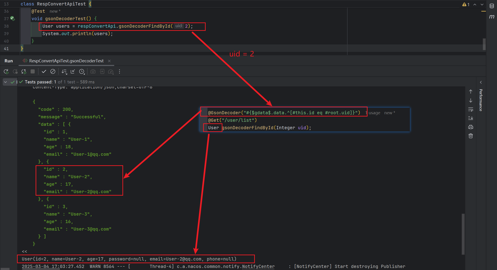

## 🦄 注解转换器[（ResponseConvert）](../../../src/main/java/com/luckyframework/httpclient/proxy/convert/ResponseConvert.java)

`ResponseConvert`为注解转换器，它的注册依赖于[@ResultConvertMeta](../../../src/main/java/com/luckyframework/httpclient/proxy/annotations/ResultConvertMeta.java)注解，相对通用转换器`Response.AutoConvert`来说，注解转换器
的优`先级别更高`、`控制力度更细`，所以更加适合一些特殊的转换需求。

---

### # 接口介绍
```java
@FunctionalInterface
public interface ResponseConvert {

    /**
     * 将相应实体转化为指定类型的实体
     *
     * @param response 响应实体
     * @param context  转化器注解上下文
     * @param <T>      返回实体类型
     * @return 返回实体
     * @throws Exception 转换失败会抛出异常
     */
    <T> T convert(Response response, ConvertContext context) throws Throwable;
}
```
---

### # 注册注解转换器
注册`注解转换器`需要借助[@ResultConvertMeta](../../../src/main/java/com/luckyframework/httpclient/proxy/annotations/ResultConvertMeta.java)注解来实现。下面我们用一个案例来加以说明：

现在需要定义一个这样的转换器：
1. 指定`Json`反序列化方案为`Google GSON`
2. 支持自定义时间字段的反序列化格式
3. 支持使用`SpEL表达式`来转换响应结果

开发流程：  
1. 定义一个用于实现以上转换逻辑的注解转换器`GsonResponseConvert`
2. 定义一个用于注册该注解转换器的注解`@GsonDecoder`

具体代码：  

> #`@GsonDecoder`注解源码
```java
import com.luckyframework.httpclient.proxy.annotations.ObjectGenerate;
import com.luckyframework.httpclient.proxy.annotations.ResultConvertMeta;
import com.luckyframework.reflect.Combination;
import org.springframework.core.annotation.AliasFor;

import java.lang.annotation.Documented;
import java.lang.annotation.ElementType;
import java.lang.annotation.Inherited;
import java.lang.annotation.Retention;
import java.lang.annotation.RetentionPolicy;
import java.lang.annotation.Target;

@Target({ElementType.METHOD, ElementType.TYPE, ElementType.ANNOTATION_TYPE})
@Retention(RetentionPolicy.RUNTIME)
@Documented
@Inherited
@Combination({ResultConvertMeta.class})
@ResultConvertMeta(convert = @ObjectGenerate(GsonResponseConvert.class))
public @interface GsonDecoder {

    /**
     * 同 select
     */
    @AliasFor("select")
    String value() default "";

    /**
     * 结果选择表达式，支持SpEL表达式
     */
    @AliasFor("value")
    String select() default "";

    /**
     * 时间格式
     */
    String dateFormat() default "yyyy-MM-dd HH:mm:ss";

    /**
     * 转换元类型
     */
    @AliasFor(annotation = ResultConvertMeta.class, attribute = "metaType")
    Class<?> metaType() default Object.class;
}
```
注解说明：  
- `select`/`value` : 结果选择表达式，支持SpEL表达式，配置之后将返回该表达式的结果
- `dateFormat`：如果存在时间字段，使用该格式进行转换  
- 如下代码用于注册注解转换器`GsonResponseConvert`
```java
@Combination({ResultConvertMeta.class})
@ResultConvertMeta(convert = @ObjectGenerate(GsonResponseConvert.class))
```

> #`GsonResponseConvert`类源码

```java
import com.alibaba.nacos.shaded.com.google.gson.Gson;
import com.alibaba.nacos.shaded.com.google.gson.GsonBuilder;
import com.luckyframework.common.StringUtils;
import com.luckyframework.httpclient.core.meta.Response;
import com.luckyframework.httpclient.proxy.convert.ConvertContext;
import com.luckyframework.httpclient.proxy.convert.ResponseConvert;
import com.luckyframework.spel.LazyValue;

import java.lang.reflect.Type;

public class GsonResponseConvert implements ResponseConvert {

    private final GsonBuilder gsonBuilder = new GsonBuilder();

    @Override
    public <T> T convert(Response response, ConvertContext context) throws Throwable {
        // 获取GsonDecoder注解实例
        GsonDecoder gsonDecoderAnn = context.toAnnotation(GsonDecoder.class);

        // 设置时间格式，并创建Gson实例
        String dateFormat = gsonDecoderAnn.dateFormat();
        if (StringUtils.hasText(dateFormat)) {
            gsonBuilder.setDateFormat(dateFormat);
        }
        Gson gson = gsonBuilder.create();

        Type methodReturnType = context.getRealMethodReturnType();
        String select = gsonDecoderAnn.select();
        if (StringUtils.hasText(select)) {
            // 获取转换元类型
            Class<?> convertMetaType = context.getConvertMetaType();
            // 向上下文变量中添加一个Root变量$gdata$
            context.getContextVar().addRootVariable("$gdata$", LazyValue.of(() -> gson.fromJson(response.getStringResult(),convertMetaType)));
            // 运行结果选择表达式，返回结果
            return context.parseExpression(select, methodReturnType);
        } else {
            return gson.fromJson(response.getStringResult(), methodReturnType);
        }
    }
}

```

> #给接口标注上`@GsonDecoder`注解，应用注解转换器`GsonResponseConvert`功能

```java
@DomainName("http://localhost:8864")
public interface AnnConvertApi {

    @Mock
    @GsonDecoder("#{$gdata$.data.email}")
    @Get("/user/get/#{uid}")
    String getUserEmail(Integer uid);

    static MockResponse getUserEmail$Mock(@Param("#{uid}") Integer uid) {
        User user = new User();
        user.setId(uid);
        user.setName("User-" + uid);
        user.setEmail(StringUtils.format("{}@qq.com", user.getName()));
        user.setPhone("17455678790");
        return MockResponse.create().status(200).json(Result.success(user));
    }
}
```

运行结果：  
