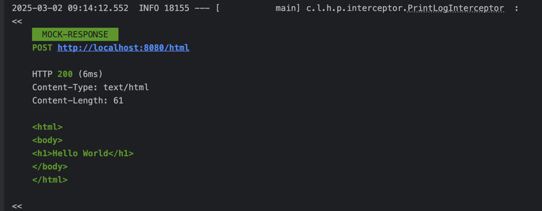
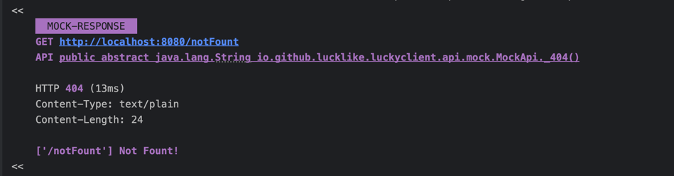
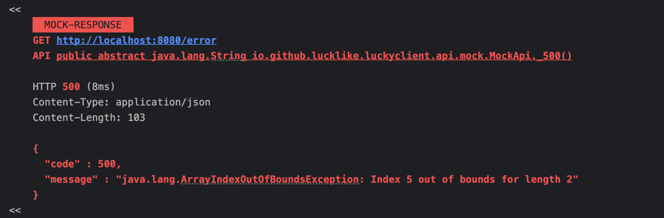
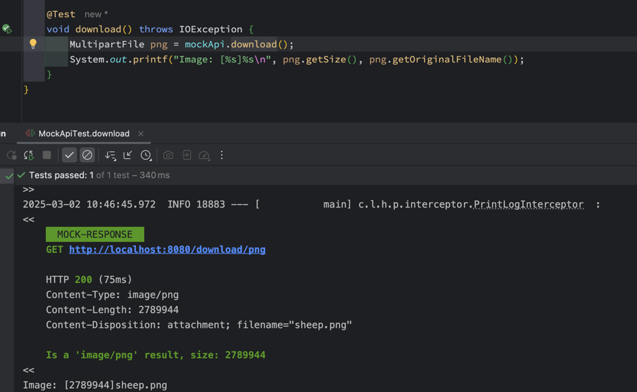
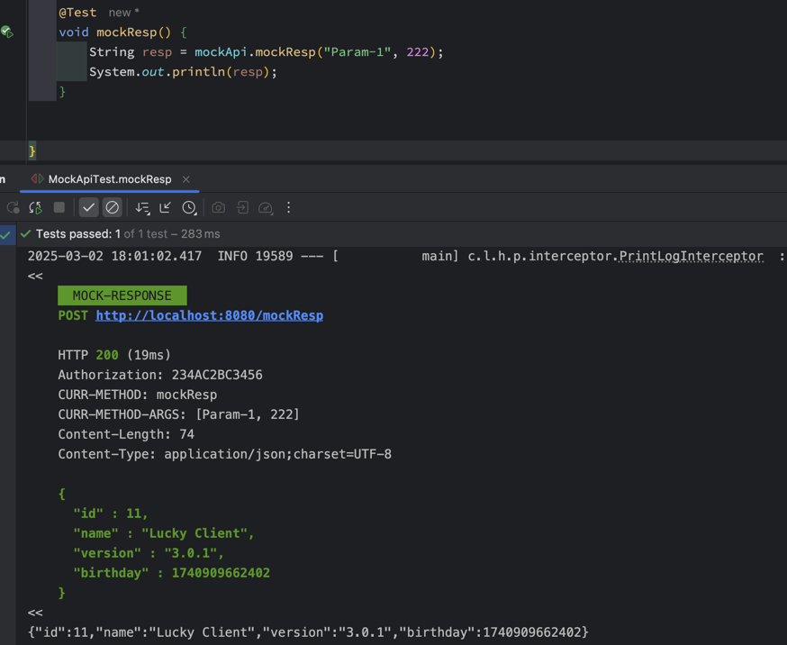
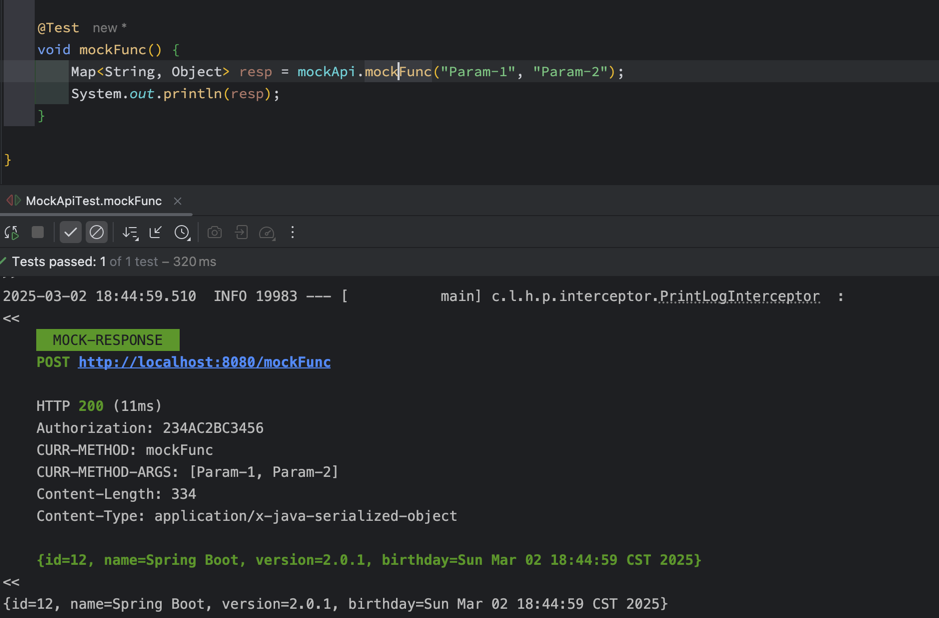
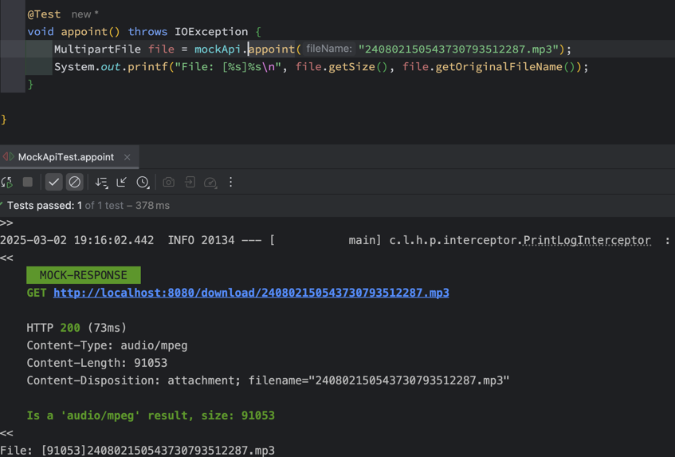
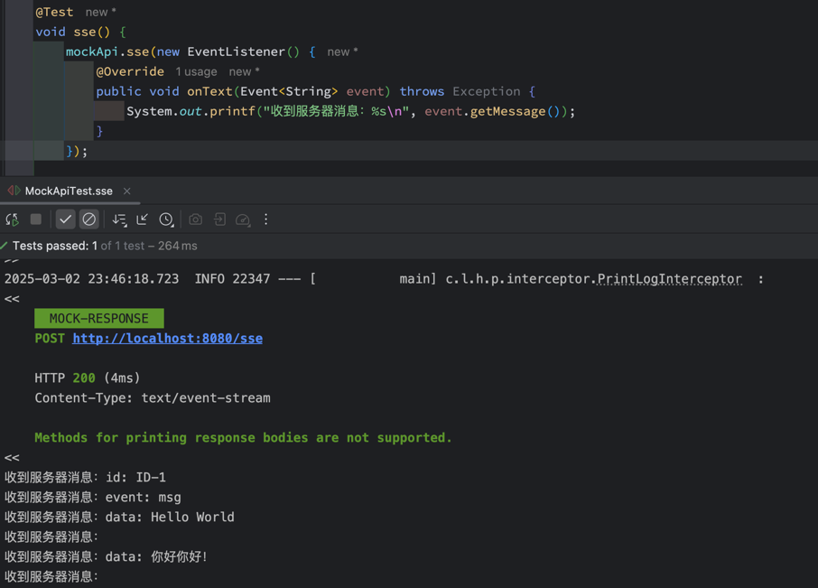
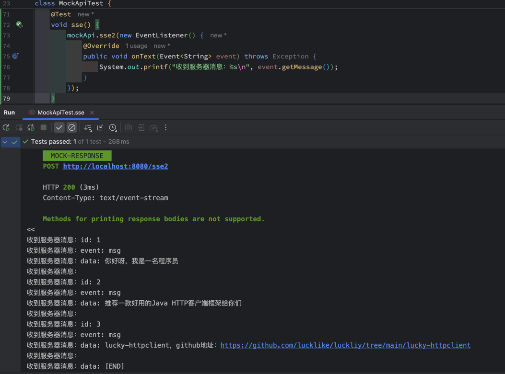

## 🦉 Mock

在 HTTP 相关的开发和测试中，`Mock（模拟）`是一种技术，用于创建虚假的 HTTP 请求或响应，以在没有真实后端服务的情况下进行测试或开发。

---

### # 使用[@Mock](../../../src/main/java/com/luckyframework/httpclient/proxy/mock/Mock.java)注解开启模拟功能

- `@Mock`**注解属性介绍**

| 属性                 | 说明                                                                                                                                                                                                                                           | 是否支持SpEL表达式 |
|--------------------|----------------------------------------------------------------------------------------------------------------------------------------------------------------------------------------------------------------------------------------------|:-----------:|
| `enable`           | 是否开启Mock功能，默认开启                                                                                                                                                                                                                              |      ✅      |
| `status`           | 模拟响应吗                                                                                                                                                                                                                                        |      ✅      |
| `header`           | 模拟响应头，格式`${key}:${value}`                                                                                                                                                                                                                    |      ✅      |
| `body`             | 模拟响应体，支持如下返回值类型：<br/>`String`: 文本类型响应体，具体`Content-Type`需要在`header`中配置<br/>`byte[]`/`InputStreamSource`/`ByteBuffer`: 二进制响应体，具体`Content-Type`需要在`header`中配置<br/>`File`/`Resource`: 资源类型响应体，`Content-Type`会自动根据文件获取，并且会设置`Content-Disposition` |      ✅      |
| `mockResp`/`value` | 用于生成[MockResponse](../../../src/main/java/com/luckyframework/httpclient/proxy/mock/MockResponse.java)的`SpEL`表达式，该实例表示一个具体的模拟响应体                                                                                                              |      ✅      |
| `mockFunc`         | 指定一个用于生成[MockResponse](../../../src/main/java/com/luckyframework/httpclient/proxy/mock/MockResponse.java)的`SpEL`函数                                                                                                                           |      ❌      |
| `cache`            | 是否缓存第一次生成的Mock响应对象，默认关闭                                                                                                                                                                                                                      |      ❌      |

- **优先级说明**

`mockResp` > `mockFunc` > `${methodName}$Mock` > `status + header + body`

### # 使用`status`、`header`、`body` 生成模拟响应体

> - 模拟正常响应

```java

@DomainName("http://localhost:8080")
public interface MockApi {

    @Mock(
            status = "200",
            header = "Content-Type: text/html",
            body = "<!DOCTYPE html><html><body><h1>Hello World</h1></body></html>"
    )
    @Post("html")
    String html();
}
```

响应：  


> - 模拟`404`响应

```java

@DomainName("http://localhost:8080")
public interface MockApi {

    @Mock(
            status = "404",
            body = "['#{$req$.getURI().getPath()}'] Not Fount!"
    )
    @Get("notFount")
    String _404();
}
```

响应：  


> - 模拟`500`响应

```java

@DomainName("http://localhost:8080")
public interface MockApi {

    @Mock(
            status = "500",
            header = "Content-Type: application/json",
            body = "{\"code\": 500,\"message\": \"java.lang.ArrayIndexOutOfBoundsException: Index 5 out of bounds for length 2\"}"
    )
    @Get("error")
    String _500();
}
```

响应：  


> - 模拟文件下载响应

我们在`classpath`下放一张名称为`sheep.png`的图片，用于模拟文件响应

```java

@DomainName("http://localhost:8080")
public interface MockApi {

    @Mock(body = "#{#resource('classpath:sheep.png')}")
    @Get("download/png")
    MultipartFile download();
}
```

响应：  


---

### # 使用`mockResp`生成模拟响应体

`mockResp`支持`SpEL`表达式，此表达式结果必须为[MockResponse](../../../src/main/java/com/luckyframework/httpclient/proxy/mock/MockResponse.java)
对象实例

```java

@DomainName("http://localhost:8080")
public interface MockApi {


    @Mock(mockResp = "#{$this$.mockRespDemo($mc$)}")
    @Post("mockResp")
    String mockResp(String p1, int p2);

    // 构造模拟响应体的方法
    default MockResponse mockRespDemo(MethodContext mc) {
        MockResponse mockResp = MockResponse.create();
        // 设置状态码
        mockResp.status(200);
        // 设置Content-Type
        mockResp.contentType("application/json");
        // 设置Header
        mockResp.header(HttpHeaders.AUTHORIZATION, "234AC2BC3456");
        mockResp.header("CURR-METHOD", mc.getCurrentAnnotatedElement().getName());
        mockResp.header("CURR-METHOD-ARGS", Arrays.toString(mc.getArguments()));

        // 设置响应体
        Map<String, Object> bodyMap = new LinkedHashMap<>();
        bodyMap.put("id", 11);
        bodyMap.put("name", "Lucky Client");
        bodyMap.put("version", "3.0.1");
        bodyMap.put("birthday", new Date());
        mockResp.json(bodyMap);

        return mockResp;
    }
}
```

响应：  


---

### # 使用`mockFunc`生成模拟响应体

`mockFunc`本质上也是调用`SpEL`函数来生成`MockResponse`对象，与`mockResp`不同的是，`mockFunc`只用指定函数名即可，
函数参数不用手动传递，框架会自动进行推断。

```java
@DomainName("http://localhost:8080")
public interface MockApi {

    @Mock(mockFunc = "mockFuncDemo")
    @Post("mockFunc")
    Map<String, Object> mockFunc(String p1, String p2);

    // 构造模拟响应体的方法，SpEL函数方法必须是static修饰的
    static MockResponse mockFuncDemo(Method method, @Param("#{$args$}") Object[] args) {
        MockResponse mockResp = MockResponse.create();
        // 设置状态码
        mockResp.status(200);
        // 设置Content-Type
        mockResp.contentType("application/x-java-serialized-object");
        // 设置Header
        mockResp.header(HttpHeaders.AUTHORIZATION, "234AC2BC3456");
        mockResp.header("CURR-METHOD", method.getName());
        mockResp.header("CURR-METHOD-ARGS", Arrays.toString(args));

        // 设置响应体
        LinkedHashMap<String, Object> bodyMap = new LinkedHashMap<>();
        bodyMap.put("id", 12);
        bodyMap.put("name", "Spring Boot");
        bodyMap.put("version", "2.0.1");
        bodyMap.put("birthday", new Date());
        mockResp.java(bodyMap);

        return mockResp;
    }
}
```

响应：  


---

### # 使用`约定SpEL方法`来完成模拟

加上`@Mock`注解而且`不做任何配置`时，lucky会尝试去查找有没有`约定的Mock方法`，如果有则会直接约定方法来完成
Mock操作。

- 约定方法的命名规范：
>` ${targetMethodName}+$Mock`

```java
@DomainName("http://localhost:8080")
public interface MockApi {
    
    // enable = "${mock.enable:true}"表示是否开启Mock功能取决于Spring环境变量${mock.enable}，没配置时默认开启
    @Mock(enable = "${mock.enable:true}")
    @Get("download/#{fileName}")
    MultipartFile appoint(String fileName);

    // appoint方法约定的Mock方法【${targetMethodName} + $Mock】 -> appoint$Mock
    static MockResponse appoint$Mock(@Param("#{fileName}") String fileName) {
        MockResponse mockResponse = MockResponse.create();
        mockResponse.status(200);
        mockResponse.resource(String.format("classpath:%s", fileName));
        return mockResponse;
    }
}
```

响应：  


---
### # SSE响应Mock

- 使用[SseMock](../../../src/main/java/com/luckyframework/httpclient/proxy/mock/SseMock.java)来生成SSE模拟响应数据

```java
@DomainName("http://localhost:8080")
public interface MockApi {

    @Sse
    @Mock
    @Post("sse")
    void sse(EventListener listener);


    static MockResponse sse$Mock() {
        MockResponse mockResponse = MockResponse.create();
        mockResponse.status(200);
        mockResponse.sse(
                SseMock.create()
                        .addSection(
                                SseMock.section()
                                        .id("ID-1")
                                        .event("msg")
                                        .data("Hello World")
                        ).addData("你好你好！")
        );
        return mockResponse;
    }
}
```

响应：  


- 从文件中读取SSE响应内容

在`classpath`下定义一个名称为`sse-mock.data`的文件，内容如下：

```yaml
id: 1
event: msg
data: 你好呀，我是一名程序员

id: 2
event: msg
data: 推荐一款好用的Java HTTP客户端框架给你们

id: 3
event: msg
data: lucky-httpclient，github地址：https://github.com/lucklike/luckliy/tree/main/lucky-httpclient

data: [END]
```

```java
@DomainName("http://localhost:8080")
public interface MockApi {

    @Sse
    @Mock
    @Post("sse2")
    void sse2(EventListener listener);


    static MockResponse sse2$Mock() {
        MockResponse mockResponse = MockResponse.create();
        mockResponse.status(200);
        mockResponse.sse(SseMock.resource("classpath:sse-mock.data"));
        return mockResponse;
    }
}
```
响应：  



