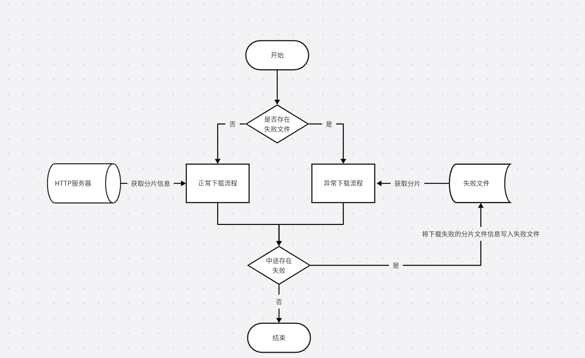

## ⏬ 异步分片文件下载

HTTP 分片文件下载（也叫 `分块下载` 或 `断点续传`）是通过 `Range 请求`
实现的，这种方式允许客户端从服务器上下载文件的特定部分（即文件的片段），而不是一次性下载整个文件。这在下载大文件时尤其有用，可以提高下载速度，并允许在下载过程中断开连接后继续下载，从而节省时间和带宽。

1. ### Range 请求

   `HTTP/1.1 `引入了` Range `请求头，允许客户端请求文件的某个部分。服务器返回的响应中，会包含` Content-Range `
   头部，标明返回的文件片段的范围及总文件大小。

   **Range 请求头**：
    ```http request
    Range: bytes=<start>-<end>
    ```
    - `<start>` 和`<end>` 是字节范围，指示服务器返回文件的一部分。
    - 例如：`Range: bytes=0-1023 `表示请求文件的第一个 1024 字节。

   **Content-Range 响应头：**
    ```http request
   Content-Range: bytes <start>-<end>/<total>
    ```
    - `<start>` 和 `<end> `是文件片段的字节范围。
    - `<total>` 是文件的总字节数。

2. ### 分片下载的工作流程

   **客户端发起 Range 请求**：
    - 客户端知道文件的总大小（例如，通过前期的` HEAD `请求获取或从其他途径获得）。
    - 客户端向服务器发送包含` Range `请求头的 HTTP 请求，要求返回文件的部分内容。例如，客户端下载文件的前 1MB：
   ```http request
   GET /largefile.zip HTTP/1.1
   Host: example.com
   Range: bytes=0-1048575
   ```

   **服务器响应：**
    - 如果服务器支持断点续传，它会根据` Range `请求返回响应，并在` Content-Range `头中指示返回的文件片段的范围及文件总大小。例如：
   ```http request
    HTTP/1.1 206 Partial Content
    Content-Range: bytes 0-1048575/5000000
    Content-Length: 1048576
   ```

    - `206 Partial Content` 表明这是一个部分内容的响应。
    - `Content-Range` 指示文件的字节范围以及文件的总字节数。
    - 服务器将返回文件片段的数据，客户端接收到数据后，将其保存到本地文件中。

3. ### 注意事项

- **服务器支持 Range 请求**：并非所有服务器都支持断点续传（Range 请求）。服务器需要明确支持` Range `请求头，且返回
  ` 206 Partial Content `响应。
- **并行下载的复杂性**：使用多线程并行下载时，需要确保文件片段按照正确的顺序合并。如果没有正确的同步和合并机制，可能导致下载的文件损坏。
- **文件完整性检查**：下载过程中可以通过校验和（如` MD5 `或` SHA-256`）来确保文件在下载过程中没有被篡改或损坏。

---

### #使用`RangeDownloadApi`来进行编程式分片文件下载

下载逻辑流程图如下：  


1. 获取`RangeDownloadApi`实例对象

   `Java原生环境`获取实例
    ```java
    public RangeDownloadApi getRangeDownloadApi() {
        HttpClientProxyObjectFactory factory = new HttpClientProxyObjectFactory();
        //------
        // 忽略其他设置
        //------
        return factory.getProxyObject(RangeDownloadApi.class);
    }
    ```

   `SpringBoot环境`获取实例，直接使用`@HttpReference`注解来注入实例
    ```java
   @HttpReference
   private RangeDownloadApi rangeDownloadApi;
    ```

2. `RangeDownloadApi`类的主要API介绍

| 方法                                                             | 描述                                                                                                                    |
|----------------------------------------------------------------|-----------------------------------------------------------------------------------------------------------------------|
| ` boolean isSupport(Request)`                                  | 判断某个资源请求是否支持分片下载                                                                                                      |
| ` boolean hasFail(File)`                                       | 是否已经存在失败文件，`File`为下载数据的目标文件，如果存在失败文件，再次下载时就只会下载失败文件中指定的部分                                                             |
| `File downloadRetryIfFail(Request, String, String, long, int)` | 分片文件下载，如果失败则会尝试重试，`【1】Request`：请求信息 ；`【2】String`：保存下载文件的目录 ；`【3】String`: 下载文件的文件名 ；`【4】long`：分片大小；`【5】int`：最大重试次数，小于0时表示不限制重试次数 |

3. 案例说明

```java
@SpringBootTest
public class RangeDownloadApiTest {

   @HttpReference
   private RangeDownloadApi rangeDownloadApi;

   /**
    * 此种方式使用的是HttpClientProxyObjectFactory中的线程池来做的异步下载
    */
   @Test
   void rangeDownloadTest2() {
      // 构造下载请求
      String url = "https://mirrors.aliyun.com/centos/8/isos/x86_64/CentOS-8.5.2111-x86_64-boot.iso";
      Request request = Request.get(url)
                               .setConnectTimeout(120000)
                               .setWriterTimeout(60000)
                               .setReadTimeout(60000);
      
      // 文件保存路径
      String savePath = "D:/download/";
      // 文件名，设置为""表示使用原始文件名
      String fileName = "";
      
      // 分片大小（5M）
      long rangeSize = 1024 * 1024 * 5L; 
      // 最大重试次数：小于0表示无限重试，直到成功为止
      int maxRetryCount = -1;
      
      // 执行下载
      File file = rangeDownloadApi.downloadRetryIfFail(request, savePath, fileName, rangeSize, maxRetryCount);
      System.out.println(file.getAbsolutePath());
   }


   /**
    * 自定义线程池来执行异步下载任务
    */
   @Test
   void rangeDownloadTest2() {
      // 构造下载请求
      String url = "https://mirrors.aliyun.com/centos/8/isos/x86_64/CentOS-8.5.2111-x86_64-boot.iso";
      Request request = Request.get(url)
              .setConnectTimeout(120000)
              .setWriterTimeout(60000)
              .setReadTimeout(60000);

      // 文件保存路径
      String savePath = "D:/download/";
      // 文件名，设置为""表示使用原始文件名
      String fileName = "";

      // 分片大小（5M）
      long rangeSize = 1024 * 1024 * 5L;
      // 最大重试次数：小于0表示无限重试，直到成功为止
      int maxRetryCount = -1;

      // 自定义线程池
      Executor executor = Executors.newFixedThreadPool(10);

      // 执行下载
      File file = rangeDownloadApi.downloadRetryIfFail(executor, request, savePath, fileName, rangeSize, maxRetryCount);
      System.out.println(file.getAbsolutePath());
   }
}

```