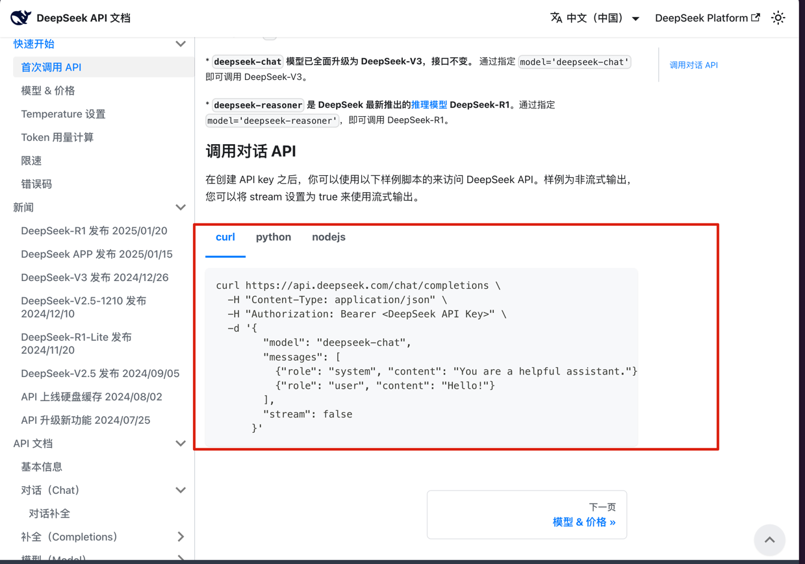
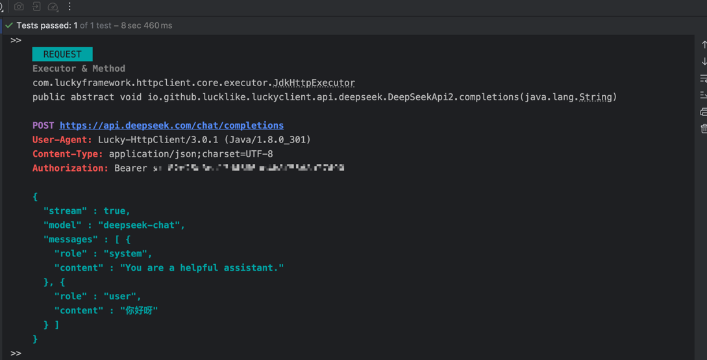
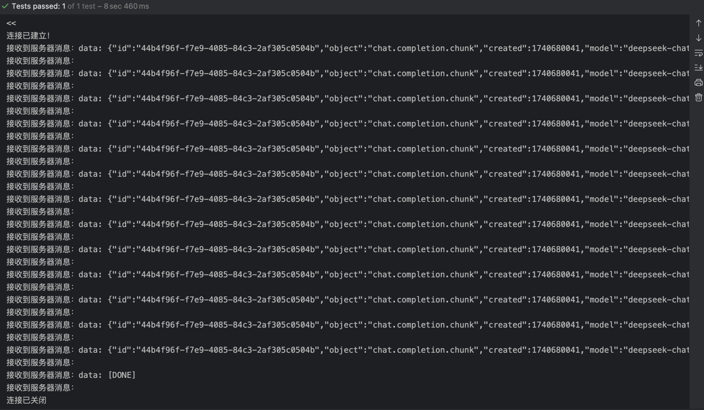

## 🐽 SSE

SSE（Server-Sent Events）是一种通过HTTP协议从服务器向客户端单向推送实时数据的技术。它允许服务器在有新数据时主动将更新推送到客户端，而不是让客户端定期发出请求。

**SSE的特点：**

1. **单向通信**：数据从服务器流向客户端。客户端无法向服务器发送消息，虽然可以通过其他方式（如HTTP请求）与服务器进行交互。
2. **基于HTTP**：SSE使用标准的HTTP协议，因此无需额外的协议或库。它是由浏览器支持的。
3. **实时推送**：适用于实时性要求高的应用场景，比如新闻推送、实时更新等。
4. **文本数据流**：SSE传输的是文本格式的数据，常见的如JSON、XML等格式。

**`SSE`与`WebSocket`的对比：**

- **SSE**：单向通信、基于HTTP、实现简单、浏览器原生支持、适用于低频更新。
- `WebSocket`：双向通信、需要专门的协议支持、适用于实时聊天、多人协作等场景。

总的来说，SSE适用于需要从服务器单向推送实时更新的应用，如股票价格更新、实时通知等，而WebSocket则适用于需要双向实时通信的场景。

---

### 在`Lucky`中调用`SSE`接口的基本步骤

1. 将在`SSE接口`上使用`@Sse`注解进行标注
2. 事件监听器[EventListener](../../../src/main/java/com/luckyframework/httpclient/proxy/sse/EventListener.java)
   ，该监听器用来监听服务器的数据响应并触发相应的回调方法
3. `SSE接口`绑定事件监听器（`EventListener`）
    - 通过`@Sse`的`listener`/`listenerClass`/`expression`属性来绑定监听器
    - 通过接口参数来传递事件监听器（该方式的优先级最高）


- `@Sse`注解属性说明

| 注解属性                                       | 说明                                                                                                                                                                                                                                                                                | 是否支持`SpEL`表达式 |
|--------------------------------------------|-----------------------------------------------------------------------------------------------------------------------------------------------------------------------------------------------------------------------------------------------------------------------------------|---------------|
| `async`                                    | `异步开关`，默认关闭                                                                                                                                                                                                                                                                       | ❌             |
| `executor`                                 | **指定异步任务的执行器**<br/>1.如果表达式结果类型为`Executor`时直接使用该执行器<br/> 2. 如果表达式结果类型为`ThreadPoolParam`时，使用`ThreadPoolFactory#createThreadPool(ThreadPoolParam)`来创建执行器 <br/>3.如果表达式结果类型为`String`时，使用`HttpClientProxyObjectFactory#getAlternativeAsyncExecutor(String)`来获取执行器 <br/> 4.返回结果为其他类型时将报错 | ✅             |
| `concurrency`                              | 最大并发数，配置之后`lucky`会为当前方法创建一个专用的线程池(使用`Executors#newFixedThreadPool(int)`创建)，此配置的优先级低于 `executor`                                                                                                                                                                                   | ✅             |
| `listener`/`listenerClass`/`expression`    | 用于绑定一个流式数据监听器（EventListener）实例 <br/>  `listener`: 通过`@ObjectGenerate`来进行配置<br/> `listenerClass` : 配使用`Class<? EventListener>`方式来配置 <br/> `expression`: 通过`SpEL`表达式来返回一个`EventListener`实例对象                                                                                        | ✅             |
| `connectionTimeout`/`connectionTimeoutExp` | 连接超时时间 <br/> `connectionTimeout`: `int`类型配置，`单位：ms ` <br/> `connectionTimeoutExp`: `String`类型配置，支持`SpEL`表达式，`单位：ms `                                                                                                                                                              | ✅             |
| `readTimeout`/`readTimeoutExp`             | 读取超时时间，默认值：`10min `<br/> `readTimeout`: `int`类型配置，`单位：ms ` <br/> `readTimeoutExp`: `String`类型配置，支持`SpEL`表达式，`单位：ms `                                                                                                                                                              | ✅             |
| `writeTimeout`/`writeTimeoutExp`           | 写超时时间 <br/> `writeTimeout`: `int`类型配置，`单位：ms ` <br/> `writeTimeoutExp`: `String`类型配置，支持`SpEL`表达式，`单位：ms `                                                                                                                                                                         | ✅             |

- `EventListener`事件方法说

| 事件方法                                   | 说明           |
|----------------------------------------|--------------|
| `void onOpen(Event<Response> event)`   | 当连接建立时触发     |
| `void onText(Event<String> event) `    | 接收到服务器的消息时触发 |
| `void onError(Event<Throwable> event)` | 当发生错误时触发     |
| `void onClose(Event<Void> event)`      | 当连接关闭时触发     |

---

### # 示例代码

以`DeepSeek`官网提供的[对话API为](https://api-docs.deepseek.com/zh-cn/)例来进行说明：


1. 实现一个事件监听器`DeepSeekEventListener`

```java
public class DeepSeekEventListener implements EventListener {

   @Override
   public void onOpen(Event<Response> event) throws Throwable {
      System.out.println("连接已建立！");
   }

   @Override
   public void onText(Event<String> event) throws Exception {
      System.out.println("接收到服务器消息：" + event.getMessage());
   }

   @Override
   public void onError(Event<Throwable> event) {
      System.out.println("发生异常: " + event.getMessage().getMessage());
   }

   @Override
   public void onClose(Event<Void> event) {
      System.out.println("连接已关闭");
   }
}

```

2. 声明SSE接口并绑定上面实现的事件监听器`DeepSeekEventListener`

  为了方便传参在`classpath`下构建一个名为`deepseek-param.json`的json文件用于参数读取。  

 ` classpath: deepseek-param.json`，其中`"content": "#{content}"`表示`content`来自参数列表的名称为`content`参数
```json
 {
   "stream": true,
   "model": "deepseek-chat",
   "messages": [
      {
         "role": "system",
         "content": "You are a helpful assistant."
      },
      {
         "role": "user",
         "content": "#{content}"
      }
   ]
}
```

定义`DeepSeek`对话接口

```java
@DomainName("${DeepSeek.url}")
public interface DeepSeekApi {

   /*
      通过@Sse注解的listenerClass来绑定事件监听器，DeepSeekEventListener为单利模式创建
    */
   @Sse(listenerClass = DeepSeekEventListener.class)
   @StaticJsonBody("``#{#read(#resource('classpath:deepseek-param.json'))}``")
   @StaticHeader("Authorization: Bearer ${DeepSeek.apiKey}")
   @Post("/chat/completions")
   void completions(String content);


   /*
      通过@Sse注解的listener来绑定事件监听器，scope = Scope.PROTOTYPE 表示DeepSeekEventListener的创建模式为多例，即每次请求都会创建一个全新的实例   
    */
   @Sse(listener = @ObjectGenerate(clazz = DeepSeekEventListener.class, scope = Scope.PROTOTYPE))
   @StaticJsonBody("``#{#read(#resource('classpath:deepseek-param.json'))}``")
   @StaticHeader("Authorization: Bearer ${DeepSeek.apiKey}")
   @Post("/chat/completions")
   void completions2(String content);


   /*
      通过参数来传递事件监听器     
    */
   @Sse
   @StaticJsonBody("``#{#read(#resource('classpath:deepseek-param.json'))}``")
   @StaticHeader("Authorization: Bearer ${DeepSeek.apiKey}")
   @Post("/chat/completions")
   void completions3(String content, DeepSeekEventListener listener);
}
```

编写单元测试类
```java
@SpringBootTest
class DeepSeekApiTest {

    @Resource
    private  DeepSeekApi api;

    @Test
    void completions() {
        api.completions("你好呀");
    }

    @Test
    void completions2() {
        api.completions2("你好呀");
    }

    @Test
    void completions3() {
        api.completions3("你好呀", new DeepSeekEventListener());
    }
}
```

最终的执行日志：

请求：  


响应：  


---
### 扩展
如果你是一个有追求的开发者，那你一定很不喜欢上面接口上标注的一大堆注解吧！嘿嘿，这不巧了吗，我也不喜欢，遇到这种情况我个人更加倾向于将上面一大堆注解
全部通过[组合注解的机制]()封装到一个注解中

封装一个组合注解`@DeepSeekChat`
```java
/*
     组合注解，相当于@Sse + @StaticJsonBody + @StaticHeader
 */
@Target({ElementType.METHOD, ElementType.TYPE, ElementType.ANNOTATION_TYPE})
@Retention(RetentionPolicy.RUNTIME)
@Documented
@Inherited
@Sse
@StaticJsonBody("")
@StaticHeader("Authorization: Bearer ${DeepSeek.apiKey}")
public @interface DeepSeekChat {

    @AliasFor(annotation = StaticJsonBody.class, attribute = "value")
    String param() default "``#{#read(#resource('classpath:deepseek-param.json'))}``";

    @AliasFor(annotation = Sse.class, attribute = "listenerClass")
    Class<? extends EventListener> listenerClass() default DeepSeekEventListener.class;
}

```

使用`@DeepSeekChat`注解改造上面的案例，这下清爽多了，哈哈哈哈！！
```java
@DomainName("${DeepSeek.url}")
public interface DeepSeekApi {

   /*
      通过@Sse注解的listenerClass来绑定事件监听器，DeepSeekEventListener为单利模式创建
    */
   @DeepSeekChat
   @Post("/chat/completions")
   void completions(String content);

   /*
      通过参数来传递事件监听器     
    */
   @DeepSeekChat
   @Post("/chat/completions")
   void completions3(String content, DeepSeekEventListener listener);
}
```

