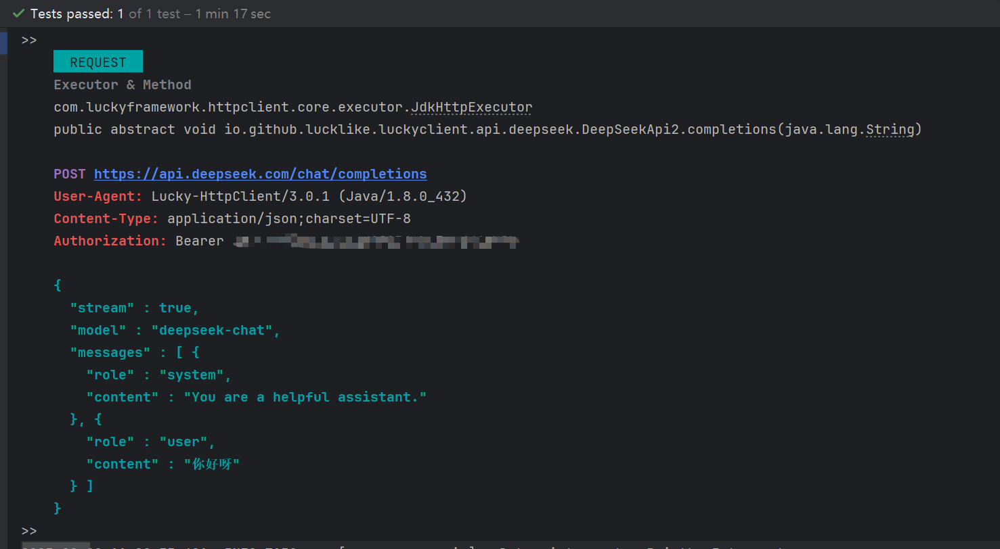

## 🐸 `text/event-stream`

`text/event-stream `是一种用于 Server-Sent Events (SSE) 的 MIME 类型，表示服务器通过 HTTP 协议向客户端推送事件流的数据格式。SSE
使用这种格式来实时传递数据流。与 WebSocket 或轮询不同，SSE 让服务器主动将数据发送到浏览器，而不是让浏览器频繁请求数据。

#### `text/event-stream `格式概述：

数据流由一个或多个事件组成，每个事件以文本形式通过 HTTP 持续传输。每个事件由不同的字段组成，每个字段用换行符（\n）分隔。每个事件通常由以下几个部分组成：

- `event`（可选）：指定事件的类型。默认情况下是 `"message"`，但可以用它来标识不同类型的事件。
- `data`（必需）：事件的有效数据。通常是要推送给客户端的数据，通常是JSON格式或纯文本。
- `id`（可选）：事件的标识符。通常用于实现事件的顺序或在断线重连时继续接收事件。
- `retry`（可选）：指定客户端在连接断开后自动重连的时间间隔（单位是毫秒）。

#### `text/event-stream` 格式示例：

一个简单的 `text/event-stream` 数据流如下所示：

```yaml
# 数据段一
event: message
data: Hello, World!

# 数据段二
event: customEvent
data: { "key": "value", "status": "active" }

# 数据段三
id: 123
data: This is a continuation of the last message

# 数据段四
retry: 10000

```

---

### # 使用[StandardEventListener](../../../src/main/java/com/luckyframework/httpclient/proxy/sse/standard/StandardEventListener.java)来监听`text/event-stream`格式数据

`StandardEventListener`继承自`EventListener`，针对`text/event-stream`格式数据进行了封装，提供了更加方便的数据操作API。

- [StandardEventListener](../../../src/main/java/com/luckyframework/httpclient/proxy/sse/standard/StandardEventListener.java)
  主要API介绍

| 方法                                      | 说明                                                                                                                                                                   |
|-----------------------------------------|----------------------------------------------------------------------------------------------------------------------------------------------------------------------|
| `void onOpening(Event<Response> event)` | 当连接建立时触发                                                                                                                                                             |
| `void onMessage(Event<Message> event)`  | 当接收到服务器发送的一段完整的消息之后出发，`text/event-stream`数据会被封装为[Message](../../../src/main/java/com/luckyframework/httpclient/proxy/sse/standard/Message.java)对象，通过该对象可以很方便的来获取消息数据 |
| `void onError(Event<Throwable> event) ` | 当发生异常时触发                                                                                                                                                             |
| `void onClosed(Event<Void> event)`      | 当连接关闭时触发                                                                                                                                                             |

- [Message](../../../src/main/java/com/luckyframework/httpclient/proxy/sse/standard/Message.java)主要API介绍

| 方法                                                                | 说明                                              |
|-------------------------------------------------------------------|-------------------------------------------------|
| `String getId()`                                                  | 获取事件的标识符`id: xxx `                              |
| `String getEvent()`                                               | 获取事件类型`event: xxx`                              |
| `String getData()`                                                | 获取事件具体数据`data: xxx`                             |
| `String getRetry()`                                               | 获取事件自动重连的时间间隔`retry: xxx`                       |
| `String getComment()`                                             | 获取注释信息`: xxx `                                  |
| `String getProperty(String key)`                                  | 获取指定key的数据 `${key}: xxx `                       |
| `T fromJsonData(SerializationTypeToken<T> token)`                 | 将`JSON`格式的`data:`数据转为`Java实体 `                  |
| `T fromJsonData(Type type)`                                       | 将`JSON`格式的`data:`数据转为`Java实体`                   |
| `ConfigurationMap jsonDataToMap()`                                | 将`JSON`格式的`data:`数据转为`ConfigurationMap`对象       |
| `T fromJsonProperty(String key, SerializationTypeToken<T> token)` | 将指定key的`JSON`格式`${key}:`数据转为`Java实体 `           |
| `<T> T fromJsonProperty(String key, Type type)`                   | 将指定key的`JSON`格式`${key}:`数据转为`Java实体 `           |
| `ConfigurationMap jsonPropertyToMap(String key) `                 | 将指定key的`JSON`格式`${key}:`数据转为`ConfigurationMap ` |

---

### # 示例代码
> 还是以`DeepSeek`官网提供的[对话API为](https://api-docs.deepseek.com/zh-cn/)例来进行说明：

DeepSeekApi响应结果的`data:`部分如下：
```json
{
  "id": "8cdd7249-d88f-4481-b33b-a90a0a2d1886",
  "object": "chat.completion.chunk",
  "created": 1740712104,
  "model": "deepseek-chat",
  "system_fingerprint": "fp_3a5770e1b4_prod0225",
  "choices": [
    {
      "index": 0,
      "delta": {
        "content": "回复内容"
      },
      "logprobs": null,
      "finish_reason": "stop"
    }
  ],
  "usage": {
    "prompt_tokens": 11,
    "completion_tokens": 12,
    "total_tokens": 23,
    "prompt_tokens_details": {
      "cached_tokens": 0
    },
    "prompt_cache_hit_tokens": 0,
    "prompt_cache_miss_tokens": 11
  }
}
```

1. 使用`StandardEventListener`来改造监听器，这一次我们只取`回复内容`部分进行打印

`DeepSeekStandardEventListener`
```java
public class DeepSeekStandardEventListener extends StandardEventListener {

  @Override
  protected void onOpening(Event<Response> event) throws Exception {
    System.out.println("连接已建立！");
  }

  @Override
  protected void onMessage(Event<Message> event) throws Exception {
    Message message = event.getMessage();
    if ("[DONE]".equals(message.getData().trim())) {
      System.out.println("DeepSeek回复结束.");
    } else {
      // 将Json格式的data: 数据转化为ConfigurationMap对象
      ConfigurationMap jsonMap = message.jsonDataToMap();
      // 获取回复内容【choices[0].delta.content】并打印
      System.out.println(jsonMap.getProperty("choices[0].delta.content"));
    }
  }


  @Override
  public void onError(Event<Throwable> event) {
    System.out.println("发生异常: " + event.getMessage().getMessage());
  }


  @Override
  protected void onClosed(Event<Void> event) {
    System.out.println("连接已关闭");
  }
}

```
2. 使用`DeepSeekStandardEventListener`来改造之前的`DeepSeekApi`接口
```java
@DomainName("${DeepSeek.url}")
public interface DeepSeekApi {

   /*
      通过@Sse注解的listenerClass来绑定事件监听器，这次绑定DeepSeekStandardEventListener
    */
   @Sse(listenerClass = DeepSeekStandardEventListener.class)
   @StaticJsonBody("``#{#read(#resource('classpath:deepseek-param.json'))}``")
   @StaticHeader("Authorization: Bearer ${DeepSeek.apiKey}")
   @Post("/chat/completions")
   void completions(String content);

}
```

请求：  

响应：  


---
### # 使用[AnnotationStandardEventListener](../../../src/main/java/com/luckyframework/httpclient/proxy/sse/standard/AnnotationStandardEventListener.java)来监听`text/event-stream`格式数据

`AnnotationStandardEventListener`继承自`StandardEventListener`，扩展了`onMessage`方法，提供了基于[@OnMessage](../../../src/main/java/com/luckyframework/httpclient/proxy/sse/OnMessage.java)注解的`消息路由`与`消息获取`的能力

> 使用`@OnMessage`注解来做消息路由

`AnnotationStandardEventListener`在初始化时会收集类中所有被`@OnMessage`标注的方法，并生成一个`严格按照方法声明顺序`排列的集合，
在`onMessage方法`执行时会按照顺序遍历所有`@OnMessage`方法，并判断`@OnMessage`注解中的`value`属性对应的`SpEL表达式`结果是否为`true`，如果为`true`
则会执行对应的方法并结束`onMessage方法`方法的执行，反之则会按照顺序继续便利，直到找到表达式结果为`true`的方法为止。  
例如：

```java
// 当事件类型（event: 部分）为'message'时执行
@OnMessage("#{$event$ eq 'message'}")
public void m1(){
    //......
}

// 当事件ID（id: 部分）为'213232'时执行
@OnMessage("#{$id$ eq '213232'}")
public void m2(){
  //......
}
```

> 方法参数获取逻辑

1. 特殊类型参数

- [Event](../../../src/main/java/com/luckyframework/httpclient/proxy/sse/Event.java)
- [Context](../../../src/main/java/com/luckyframework/httpclient/proxy/context/Context.java)
- [Message](../../../src/main/java/com/luckyframework/httpclient/proxy/sse/standard/Message.java)
- [MessageMethod](../../../src/main/java/com/luckyframework/httpclient/proxy/sse/MessageMethod.java)
- [This(自身)]()

2. 使用`@Param`注解来使用`SpEL表达式`，表达式结果将会被注入到对应的参数中

- `@Param("#{#uuid()}")`: 注入一个随机的UUID
- `@Param("#{$this$}")`: 注入当前监听器对象实例
- `@Param("#{$jdata$}")`:注入被转化为Java对象的`data:`部分数据(`只有在data数据为json格式才能使用`)
- `@Param("#{$data$}")`:注入原始`data:`数据  
- 其他可以使用`SpELRoot对象`请自行到`AnnotationStandardEventListener`类中查看

3. 如果是`SpringBoot`环境，则还支持如下参数

- `@Value注解`：注入`Spring环境变量`中的变量
- `@Qualifier注解`：按名称注入`Spring容器`中的`Bean`
- 其他类型会尝试通过类型到Spring容器中获取Bean

改造后基于`AnnotationStandardEventListener`实现的监听器，该监听器可以完成相同的效果

```java
public class DeepSeekAnnotationStandardEventListener extends AnnotationStandardEventListener {

  @OnMessage("#{$data$.trim() eq '[DONE]'}")
  public void msgEnd() {
    System.out.println("DeepSeek回复结束.");
  }

  @OnMessage
  public void printMsg(@Param("#{$jdata$.choices[0].delta.content}") String msg) {
    System.out.print(msg);
  }
}
```