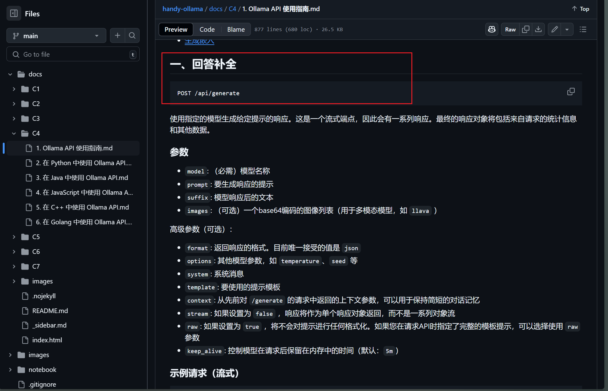
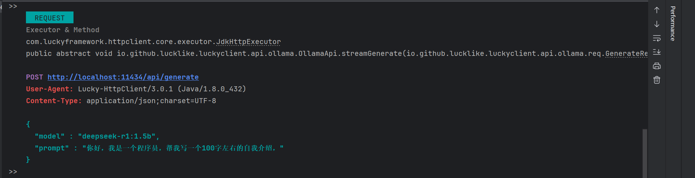
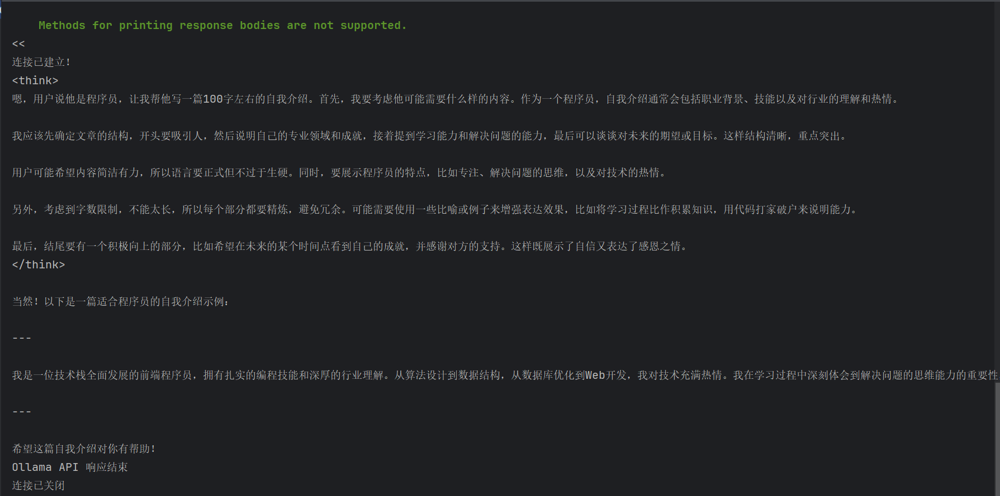

## 🐹 `application/x-ndjson`

`application/x-ndjson `是一种 MIME 类型，用于表示` NDJSON `(Newline Delimited JSON) 格式的数据。NDJSON 是一种以换行符分隔的 JSON 格式，常用于流式处理和日志记录等场景，尤其适用于需要逐条处理大量 JSON 数据的应用。下面是对它的一些详细介绍：

1. ### NDJSON 格式
   - NDJSON 是一种文本格式，其中每行都是一个有效的` JSON `对象。
   - 每个` JSON `对象都在一行中，并且行与行之间由换行符 (`\n`) 分隔。
   - 这种格式的关键优势是可以处理和传输大量的` JSON `数据，而无需将所有数据都加载到内存中，这对于流处理非常有用。
2. ### 适用场景
   - **日志记录**：由于其每行一个 JSON 对象的结构，NDJSON 非常适用于日志数据的存储和处理。
   - **数据流传输**：NDJSON 也适用于需要逐条传输或逐条处理数据的情况，比如实时数据传输、数据流处理、或者大规模批处理任务。
   - **数据处理管道**：NDJSON 在数据处理过程中经常被用作中间格式，方便在不同处理阶段进行流式读取和写入。
3. ### 与 JSON 的区别
   - **JSON**（JavaScript Object Notation）通常是一个完整的 JSON 文档，它是一个层级化的结构，整个文档是一个大的 JSON 对象。
   - **NDJSON** 是由多个独立的 JSON 对象组成的流，每个对象单独一行，可以按行读取或处理。

4. ### 示例

    假设我们有一些用户数据，每个用户信息都是一个独立的 JSON 对象，存储在 NDJSON 格式中：
    ```json
    {"id": 1, "name": "Alice", "email": "alice@example.com"}
    {"id": 2, "name": "Bob", "email": "bob@example.com"}
    {"id": 3, "name": "Charlie", "email": "charlie@example.com"}
    ```
   这段数据每一行都是一个 JSON 对象，而不是一个嵌套的 JSON 数组。

---

### # 使用[NdJsonEventListener](../../../src/main/java/com/luckyframework/httpclient/proxy/sse/ndjson/NdJsonEventListener.java)监听器来监听`NDJSON`格式数据

继承自NdJsonEventListener的类都需要提供一个具体的泛型类型，NdJsonEventListener在接收到消息后会自动的将Json数据转成该泛型类型的java对象。

以`Ollama`提供的[回答补全](https://github.com/datawhalechina/handy-ollama/blob/main/docs/C4/1.%20Ollama%20API%20%E4%BD%BF%E7%94%A8%E6%8C%87%E5%8D%97.md#%E4%B8%80%E5%9B%9E%E7%AD%94%E8%A1%A5%E5%85%A8)API为例来进行说明



1. 定义`Ollama`接口

- 声明实体类-Request
```java
@Data
public class GenerateRequest {

   /**
    * 模型名称
    */
   private String model;
    
   /**
    * 如果设置为 false ，响应将作为单个响应对象返回，而不是一系列对象流
    */
   private Boolean stream = true;

   /**
    * 要生成响应的提示
    */
   private String prompt;

   /**
    * 模型响应后的文本
    */
   private String suffix;

   /**
    * （可选）一个base64编码的图像列表（用于多模态模型，如 llava ）
    */
   private String images;

   /**
    * 返回响应的格式。目前唯一接受的值是 json
    */
   private String format;

   /**
    * 其他模型参数，如 temperature、seed 等
    */
   private String options;

   /**
    * 系统消息
    */
   private String system;

   /**
    * 要使用的提示模板
    */
   private String template;

   /**
    * 从先前对 /generate 的请求中返回的上下文参数，可以用于保持简短的对话记忆
    */
   private Integer[] context;

   /**
    * 如果设置为 true ，将不会对提示进行任何格式化。如果您在请求API时指定了完整的模板提示，可以选择使用 raw 参数
    */
   private Boolean raw;

   /**
    * 控制模型在请求后保留在内存中的时间（默认：5m）
    */
   private String keep_alive;
}
```

- 声明实体类-Response 

```java
@Data
public class GenerateResponse {

   /**
    * 模型名称
    */
   private String model;

   /**
    * 时间
    */
   private String created_at;

   /**
    * 是否已经结束
    */
   private Boolean done;

   /**
    * 停止的原因
    */
   private String done_reason;

   /**
    * 生成响应所花费的时间（纳秒）
    */
   private Long total_duration;

   /**
    * 加载模型所花费的时间（纳秒）
    */
   private Long load_duration;

   /**
    * 提示中的标记数量
    */
   private Integer prompt_eval_count;

   /**
    * 评估提示所花费的时间（纳秒）
    */
   private Long prompt_eval_duration;

   /**
    * 响应中的标记数量
    */
   private Integer eval_count;

   /**
    * 生成响应所花费的时间（纳秒）
    */
   private Long eval_duration;
    
   /**
    * 响应内容
    */
   private String response;

   /**
    * 用于此响应的对话编码，可以在下一个请求中发送以保持对话记忆
    */
   private Integer[] context;
}
```

- 定义回答补全接口
```java
@DomainName("http://localhost:11434")
public interface OllamaApi {

   @Sse
   @Post("/api/generate")
   @Describe("（流式）回答补全")
   void streamGenerate(@JsonBody GenerateRequest request, EventListener listener);
}
```
- 定义事件监听器
```java
public class OllamaGenerateEventListener extends NdJsonEventListener<GenerateResponse> {

   @Override
   public void onOpen(Event<Response> event) throws Exception {
      System.out.println("连接已建立！");
   }

   @Override
   public void onMessage(Event<GenerateResponse> event) throws Exception {
      GenerateResponse message = event.getMessage();
      if (message.getDone()) {
         System.out.println("\nOllama API 响应结束");
      } else {
         System.out.print(message.getResponse());
      }
   }

   @Override
   public void onError(Event<Throwable> event) {
      System.out.println("发生异常: " + event.getMessage().getMessage());
   }


   @Override
   public void onClose(Event<Void> event) {
      System.out.println("连接已关闭");
   }

}
```

- 编写单元测试类
```java
@SpringBootTest
class OllamaApiTest {

    @Resource
    private OllamaApi api;

    @Test
    void streamGenerate0() {
        OllamaGenerateEventListener listener = new OllamaGenerateEventListener();
        GenerateRequest request = new GenerateRequest();
        request.setPrompt("你好，我是一个程序员，帮我写一个100字左右的自我介绍，");
        request.setModel("deepseek-r1:1.5b");
        api.streamGenerate(request, listener);
    }
}
```


请求：  


响应：  


---

### #使用[AnnotationNdJsonEventListener](../../../src/main/java/com/luckyframework/httpclient/proxy/sse/ndjson/AnnotationNdJsonEventListener.java)监听器来监听`NDJSON`格式数据

此监听器类似[AnnotationStandardEventListener](../../../src/main/java/com/luckyframework/httpclient/proxy/sse/standard/AnnotationStandardEventListener.java)，扩展了`onMessage`方法，提供了基于[@OnMessage](../../../src/main/java/com/luckyframework/httpclient/proxy/sse/OnMessage.java)注解的`消息路由`与`消息获取`的能力。
具体功能描述不再赘述！

使用`AnnotationNdJsonEventListener`类改造上述案例
```java
public class OllamaAnnotationGenerateEventListener extends AnnotationNdJsonEventListener<GenerateResponse> {

   @OnMessage("#{$data$.done}")
   public void clear() {
      System.out.println("\nOllama API 响应结束");
   }

   @OnMessage
   public void output(GenerateResponse response) {
      System.out.print(message.getResponse());
   }
}
```